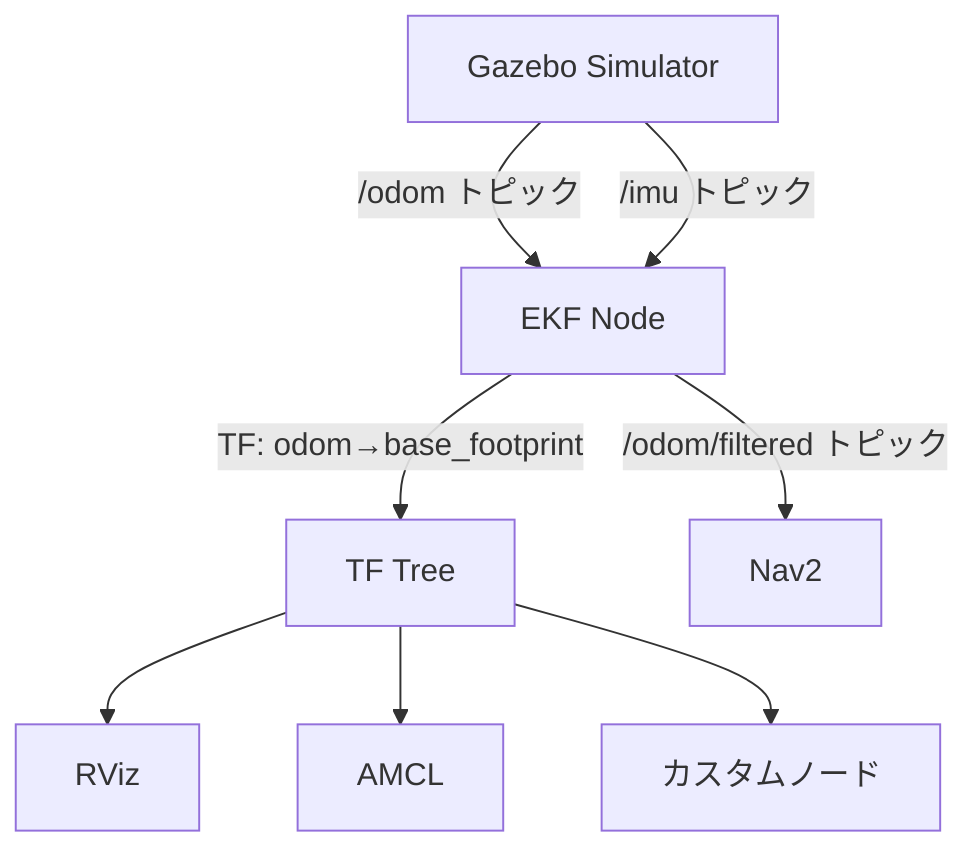

# EKFセンサフュージョン設定ガイド

## 📋 概要

このドキュメントでは、IMUとオドメトリを融合してより安定した自己位置推定を実現するためのEKF設定について説明します。

## 🔧 設定変更内容

### 1. **TF配信の責任をEKFに移行**

#### 変更前（TF競合あり）
```
Gazebo → /odom トピック → Gazebo Bridge → TF (odom → base_footprint)
                                         ↓
Gazebo → /imu トピック  → EKF ---------> /odom/filtered トピック
Gazebo → /odom トピック → EKF           (TFは配信しない)
```
- ❌ Gazeboの生データ（IMU未融合）がTFに使用される
- ❌ Nav2のみがEKFの恩恵を受ける
- ❌ RVizの表示とNav2の挙動が微妙にずれる可能性

#### 変更後（推奨構成）
```
Gazebo → /odom トピック → EKF ---------> TF (odom → base_footprint)
Gazebo → /imu トピック  → EKF ---------> /odom/filtered トピック
```
- ✅ IMU融合後のデータがTFに反映される
- ✅ システム全体でセンサフュージョンの恩恵を受ける
- ✅ RViz、Nav2、AMCL全てが一貫したデータを使用

### 2. **修正したファイル**

#### `params/ekf_fusion.yaml`
```yaml
publish_tf: true  # TF変換を配信（IMU+Odom融合後のTF）
```

#### `src/sirius_navigation/launch/sensor_fusion.launch.py`
```python
'publish_tf': True  # IMU融合後のTFを配信
```

#### `src/sirius_description/launch/sim.launch.py`
```python
# tf_bridge = Node(...)  # コメントアウト（EKFと競合するため）
```

#### `src/sirius_description/launch/launch_config_ui.py`
```python
'tf_bridge': False,  # デフォルトでFalse（EKF使用時）
```

## 🚀 起動手順

### 基本的な起動順序

1. **Gazeboシミュレーション起動**
   ```bash
   ros2 launch sirius_description sim.launch.py
   ```
   または
   ```bash
   ros2 launch sirius_description sim_with_ui.launch.py
   ```
   ※ UI版ではTF Bridgeを**無効**にしてください

2. **EKFセンサフュージョン起動**
   ```bash
   ros2 launch sirius_navigation sensor_fusion.launch.py
   ```

3. **Navigation2起動**
   ```bash
   ros2 launch nav2_bringup navigation_launch.py \
     params_file:=/home/kotantu-nuc/sirius_jazzy_ws/params/nav2_params.yaml \
     use_sim_time:=true
   ```

## 🔍 動作確認

### 1. TFツリーの確認
```bash
ros2 run tf2_tools view_frames
evince frames.pdf
```

**期待される結果:**
```
map → sirius3/odom → sirius3/base_footprint → sirius3/base_link
```
- `map → sirius3/odom`: AMCL (10 Hz)
- `sirius3/odom → sirius3/base_footprint`: **EKF** (10 Hz) ← IMU融合済み！
- 固定TF: robot_state_publisher

### 2. EKFの動作確認
```bash
# EKFが動作中か確認
ros2 node list | grep ekf

# EKFの出力を確認
ros2 topic hz /odom/filtered

# EKFがTFを配信しているか確認
ros2 run tf2_ros tf2_echo sirius3/odom sirius3/base_footprint
```

### 3. Nav2がEKFのデータを使用しているか確認
```bash
# Nav2の設定を確認
ros2 param get /bt_navigator odom_topic
# 結果: /odom/filtered

ros2 param get /velocity_smoother odom_topic
# 結果: /odom/filtered
```

## 📊 データフロー



## ⚙️ 重要なパラメータ

### EKF設定 (`ekf_fusion.yaml`)

```yaml
ekf_filter_node:
  ros__parameters:
    # フレーム設定
    odom_frame: sirius3/odom
    base_link_frame: sirius3/base_footprint
    world_frame: sirius3/odom
    
    # TF配信
    publish_tf: true  # 必ずtrue
    
    # オドメトリ入力
    odom0: /odom
    odom0_config: [true, true, false,    # x, y位置
                   false, false, false,   # 姿勢はIMU優先
                   true, true, false,     # vx, vy速度
                   false, false, false,
                   false, false, false]
    
    # IMU入力
    imu0: /imu
    imu0_config: [false, false, false,
                  false, false, true,     # yaw角のみ使用
                  false, false, false,
                  false, false, false,
                  false, false, false]
```

### Nav2設定 (`nav2_params.yaml`)

```yaml
velocity_smoother:
  ros__parameters:
    odom_topic: "/odom/filtered"  # EKFの出力を使用

bt_navigator:
  ros__parameters:
    odom_topic: /odom/filtered    # EKFの出力を使用
```

## 🐛 トラブルシューティング

### 問題: 自己位置がジャンプする

**原因:** TFが複数のソースから配信されている（競合）

**確認:**
```bash
ros2 run tf2_ros tf2_monitor sirius3/odom sirius3/base_footprint
```

**解決策:**
1. Gazeboの `tf_bridge` を無効化
2. EKFの `publish_tf: true` を確認

### 問題: EKFが起動しない

**確認:**
```bash
ros2 node list | grep ekf
ros2 topic list | grep odom
```

**解決策:**
1. `/odom` と `/imu` トピックが配信されているか確認
2. EKFのログを確認: `ros2 launch sirius_navigation sensor_fusion.launch.py`

### 問題: Nav2がEKFのデータを使用していない

**確認:**
```bash
ros2 param get /bt_navigator odom_topic
```

**解決策:**
`nav2_params.yaml` の `odom_topic` を `/odom/filtered` に設定

## 📈 メリット

1. **姿勢推定の精度向上**
   - IMUの角速度情報により、急旋回時の姿勢推定が安定
   
2. **オドメトリの補正**
   - ホイールスリップやエンコーダーノイズの影響を低減
   
3. **システムの一貫性**
   - TFとトピックが同じデータソース（EKF）から出力される
   
4. **AMCLの改善**
   - より正確なTFによりAMCLの自己位置推定も改善

5. **実機との互換性**
   - 実機でも同じ構成を使用可能

## 🎯 まとめ

- ✅ EKFがIMU+Odomを融合してTFを配信
- ✅ Gazeboの `tf_bridge` は無効化
- ✅ Nav2は `/odom/filtered` を使用
- ✅ システム全体でセンサフュージョンの恩恵を受ける

## 📚 参考資料

- [robot_localization Documentation](http://docs.ros.org/en/melodic/api/robot_localization/html/index.html)
- [Nav2 Documentation](https://navigation.ros.org/)
- [TF2 Documentation](https://docs.ros.org/en/jazzy/Concepts/Intermediate/About-Tf2.html)
