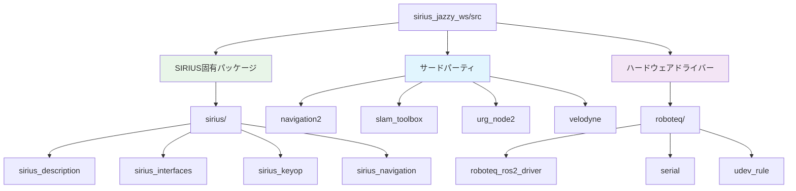

# SIRIUS Jazzy Workspace

このワークスペースは、SIRIUSロボットのROS 2 Jazzy環境用の開発環境です。

## 概要

このワークスペースには、SIRIUSロボットの自律ナビゲーション、センサー統合、および制御に必要なパッケージが含まれています。

## srcフォルダ内のパッケージ



### SIRIUS固有パッケージ (`sirius/`)
- **sirius_description**: SIRIUSロボットのURDF/Gazeboモデル
- **sirius_interfaces**: カスタムメッセージとアクション定義
- **sirius_keyop**: キーボード操作用のテレオペレーションパッケージ
- **sirius_navigation**: SIRIUS固有のナビゲーション設定とランチファイル

### サードパーティパッケージ
- **navigation2**: ROS 2の公式ナビゲーションスタック
- **slam_toolbox**: SLAMとマッピング機能を提供
- **urg_node2**: Hokuyo URGレーザースキャナードライバー
- **velodyne**: Velodyneライダーセンサードライバー

### ハードウェアドライバー (`roboteq/`)
- **roboteq_ros2_driver**: Roboteqモータードライバー本体
- **serial**: シリアル通信ライブラリ
- **udev_rule**: udevルール設定

## ビルド手順

```bash
# ワークスペースのルートディレクトリで実行
colcon build --symlink-install
```

## 使用方法

```bash
# 環境設定
source install/setup.bash

# 基本的なナビゲーション起動
ros2 launch sirius_navigation navigation.launch.py
```

## 注意事項

- `src`フォルダはgitignoreで除外されているため、パッケージの詳細な更新情報は各パッケージのREADMEを参照してください
- このワークスペースはROS 2 Jazzy環境での使用を前提としています