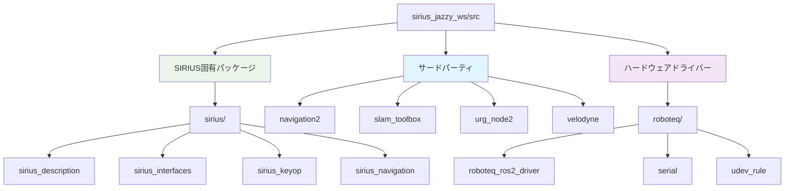

# SIRIUS Jazzy Workspace

このワークスペースは、SIRIUSロボットのROS 2 Jazzy環境用の開発環境です。

## クローン方法

### 通常のクローン
```bash
git clone --recurse-submodules https://github.com/YakiFrog/sirius_jazzy_ws.git
```

### プライベートサブモジュールがある場合
一部のサブモジュールがプライベートリポジトリのため、以下のいずれかが必要です：

#### SSH認証を使用する場合
```bash
# SSH鍵の設定後
git clone --recurse-submodules git@github.com:YakiFrog/sirius_jazzy_ws.git
```

#### 段階的にクローンする場合
```bash
# 1. メインリポジトリをクローン
git clone https://github.com/YakiFrog/sirius_jazzy_ws.git
cd sirius_jazzy_ws

# 2. 認証設定後、サブモジュールを更新
git submodule update --init --recursive
```

## 概要

このワークスペースには、SIRIUSロボットの自律ナビゲーション、センサー統合、および制御に必要なパッケージが含まれています。

## srcフォルダ内のパッケージ


```mermaid
graph TD
    A[sirius_jazzy_ws/src] --> B[SIRIUS固有パッケージ]
    A --> C[サードパーティ]
    A --> D[ハードウェアドライバー]
    
    B --> B1[sirius/]
    B1 --> B1A[sirius_description]
    B1 --> B1B[sirius_interfaces]
    B1 --> B1C[sirius_keyop]
    B1 --> B1D[sirius_navigation]
    
    C --> C1[navigation2]
    C --> C2[slam_toolbox]
    C --> C3[urg_node2]
    C --> C4[velodyne]
    
    D --> D1[roboteq/]
    D1 --> D1A[roboteq_ros2_driver]
    D1 --> D1B[serial]
    D1 --> D1C[udev_rule]
    
    style B fill:#e8f5e8
    style C fill:#e1f5fe
    style D fill:#f3e5f5
```

### SIRIUS固有パッケージ (`sirius/`)
- **sirius_description**: SIRIUSロボットのURDF/Gazeboモデル
- **sirius_interfaces**: カスタムメッセージとアクション定義
- **sirius_keyop**: キーボード操作用のテレオペレーションパッケージ
- **sirius_navigation**: SIRIUS固有のナビゲーション設定とランチファイル

### サードパーティパッケージ
- **navigation2**: ROS 2の公式ナビゲーションスタック
- **slam_toolbox**: SLAMとマッピング機能を提供
- **urg_node2**: Hokuyo URGレーザースキャナードライバー
- **velodyne**: Velodyneライダーセンサードライバー

### ハードウェアドライバー (`roboteq/`)
- **roboteq_ros2_driver**: Roboteqモータードライバー本体
- **serial**: シリアル通信ライブラリ
- **udev_rule**: udevルール設定

## ビルド手順

```bash
# ワークスペースのルートディレクトリで実行
colcon build --symlink-install
```

## 使用方法

```bash
# 環境設定
source install/setup.bash

# 基本的なナビゲーション起動
ros2 launch sirius_navigation navigation.launch.py
```

## モーター制御および速度限界（roboteq_ros2_driver）

対向2輪キャスター型（差動二輪）の特性および現在のパラメータ設定に基づいて、ロボットの指令速度（線速度 $v$・角速度 $\omega$）には以下の物理的限界があります。

### パラメータ設定値
- **トレッド幅** $T = 0.40 \text{ m}$
- **車輪の円周** $C = 0.825 \text{ m}$
- **速度スケーリング係数** $S = 0.52$
- **モーターの最大回転数** $N_{\max} = 58 \text{ RPM}$

### 限界条件式
指令する線速度 $v \text{ [m/s]}$ と角速度 $\omega \text{ [rad/s]}$ に対し、モータードライバへ送る出力コマンド（$-1000$ 〜 $1000$ デューティ比）が飽和（100%出力）しないための境界条件式は以下のようになります：

$$-1.53 \le v \pm 0.20 \omega \le 1.53 \text{ [m/s]}$$

これに基づき、以下の制限が発生します：

1. **直進時の最大線速度（$\omega = 0$）**
   - 最大線速度 $v_{\max} \approx 1.53 \text{ m/s}$
   - 指令値として $2.0 \text{ m/s}$ を送っても、モーター出力が $100\%$（`1000`）で飽和するため、物理的に $1.5 \text{ m/s}$ 付近で頭打ちになります。
2. **その場旋回時の最大角速度（$v = 0$）**
   - 最大角速度 $\omega_{\max} \approx 7.65 \text{ rad/s}$
3. **複合走行時の制限（前進しながらの旋回）**
   - 線速度と角速度はお互いの出力を制限し合います。
   - 旋回半径を $R \text{ [m]}$ としたとき、飽和せずに走行できる最大線速度 $v_{\max}(R)$ は以下の式で計算できます：
     $$v_{\max}(R) = \frac{1.53}{1 + \frac{0.20}{R}} \text{ [m/s]}$$
     - **半径 1.0 m の旋回:** 最大速度 $\approx 1.28 \text{ m/s}$
     - **半径 0.5 m の旋回:** 最大速度 $\approx 1.09 \text{ m/s}$
     - **半径 0.2 m の旋回:** 最大速度 $\approx 0.77 \text{ m/s}$

### 加速度の制限について
ロボットの加減速度は、主に以下の要素で決まります。

1. **ドライバ内のソフト制限（MAC / MDEC）：**
   - コントローラ内の最大加速度設定は `2000 RPM/s` です。これは物理的な車輪の加速度に換算すると **約 $27.5 \text{ m/s}^2$ ($2.8\text{G}$)** と非常に大きく、ドライバ側のリミッターは実質的に素通り状態です。
2. **モーターの最大トルク限界（電流制限）：**
   - ドライバの電流制限 `max_amps: 12.0 A` によって最大トルクが抑えられ、物理的な限界加速度が決まります。
3. **ソフトウェア側の制約：**
   - 安全性（スリップや急激な姿勢変化の防止）のため、通常はROS 2のプランナーや `velocity_smoother` で加速度を滑らかにします。

---

## ハードウェアスペックとNav2パラメータ（nav2_params.yaml）の対比

現在の `nav2_params.yaml` での設定値は、ロボットの持つ物理限界スペックに対して**かなり抑えられた（安全マージンを広く取った）設定**になっています。

| 項目 | 物理限界スペック | Nav2プランナー設定 (`MPPI`) | 速度スムーサー設定 (`velocity_smoother`) |
| :--- | :--- | :--- | :--- |
| **最大線速度** | **1.53 m/s** | **0.60 m/s** （性能の約39%） | **1.00 m/s** |
| **最大角速度** | **7.65 rad/s** | **0.80 rad/s** （性能の約10%） | **1.00 rad/s** |
| **最大加速度** | **約 27.5 m/s²** | **0.60 m/s²** | **1.00 m/s²** |
| **最大角加速度**| **-** | **1.80 rad/s²** | **1.80 rad/s²** |

### スペックを活かせているか？（現状分析と改善案）

現状の設定では、**ロボットのスペックを十分に活かしきれていません。**

#### 1. 「0.6 m/s 以上で速度がいびつになる」問題の真相
`nav2_params.yaml` の MPPI コントローラ設定部に、以下のコメントがありました：
> `vx_max: 0.60 # 現状、これ以上出すとRoboteqのリミッターにかかるのか、速度がいびつになる`

これはリミッターではなく、**修正前のソフトウェアフィードバック（P制御）のバグが原因**でした。
- バグ修正前は、ロボットが実際に前進（実RPM > 0）すると、目標RPM의基準値（`right_rpm_command`等）が常に `0` に固定されていたため、P制御が「速度を `0` に戻そうとする（＝ブレーキをかける）」ように動作していました。
- そのため、0.6m/s 以上の速度を出そうとすればするほど、バグによるブレーキ力が強く働いてしまい、挙動がいびつになったりガタついたりしていました。

#### 2. 今後のチューニング方針（スペックの解放）
今回、ソフトウェアフィードバックのバグが修正されたため、この「速度がいびつになる」現象は解消されます。したがって、以下のパラメータを安全な範囲で引き上げ、本来のスペックを活かした高速走行が可能です。

* **線速度の上限引き上げ：**
  - MPPIの `vx_max` を `0.80` 〜 `1.20 m/s` 付近まで上げる。
  - 同時に `velocity_smoother` の `max_velocity` の線速度を `1.20 m/s` 等に引き上げる。
* **角速度の上限引き上げ：**
  - MPPIの `wz_max` を `1.20` 〜 `1.50 rad/s` 程度まで引き上げ、旋回追従性を向上させる。
* **加速度の引き上げ（レスポンス向上）：**
  - `ax_max` や `max_accel` を `1.0` 〜 `1.2 m/s²` 程度に引き上げることで、より機敏に加速できるようになります。

## 走行モード（高速・低速安定）の動的切り替え方法

SIRIUSのナビゲーション実行中に、ロボットやROS 2を再起動することなく、コマンドラインから動的に走行モード（最高速度や加減速度制限）を切り替えることができます。

### 1. 動的パラメータ書き換えコマンド

ターミナルから以下のコマンドを実行することで、実行中のNav2プランナー（MPPI）および速度スムーサー（velocity_smoother）の制限値をリアルタイムに変更できます。

#### ■ ゆっくり・安定走行モード（例: 0.6 m/s, 加減速 0.7 m/s²）
```bash
# MPPIプランナー（目標値と加減速）の変更
ros2 param set /controller_server FollowPath.vx_max 0.6
ros2 param set /controller_server FollowPath.ax_max 0.7
ros2 param set /controller_server FollowPath.ax_min -0.7

# 速度スムーサー（加減速フィルタ）の制限値変更
ros2 param set /velocity_smoother max_velocity "[0.6, 0.0, 1.0]"
ros2 param set /velocity_smoother max_accel "[0.7, 0.0, 2.0]"
ros2 param set /velocity_smoother max_decel "[-0.7, 0.0, -2.0]"
```

#### ■ 通常・高速走行モード（例: 1.0 m/s, 加減速 1.0 m/s²）
```bash
# MPPIプランナー（目標値と加減速）の変更
ros2 param set /controller_server FollowPath.vx_max 1.0
ros2 param set /controller_server FollowPath.ax_max 1.0
ros2 param set /controller_server FollowPath.ax_min -1.0

# 速度スムーサー（加減速フィルタ）の制限値変更
ros2 param set /velocity_smoother max_velocity "[1.0, 0.0, 1.0]"
ros2 param set /velocity_smoother max_accel "[1.0, 0.0, 2.0]"
ros2 param set /velocity_smoother max_decel "[-1.0, 0.0, -2.0]"
```

### 2. エイリアス（ショートカット）による簡単切り替え

`bash_alias2.sh`に定義されているエイリアスを使用して、以下のコマンドで簡単に切り替えることができます。

```bash
# ゆっくり安全歩行モードに切り替え
nav_safe

# 通常走行モード（0.9 m/s）に切り替え
nav_normal

# パス追従優先・一時停止モード（0.5 m/s, 回避せず待機）に切り替え
nav_strict

# メニューを表示して対話的にモードを選択
nav_mode
```
このエイリアスを実行すると、自律移動中の別のターミナルで `nav_safe`、`nav_normal`、または `nav_strict` と入力するだけで即座に走行モードが切り替わります。

## ウェイポイント追従（move_goal）の仕様と判定閾値の調整

`sirius_navigation` パッケージ内の `move_goal.py` は、Nav2の単一目標（NavigateToPose）に新しい目標を上書きし続けることで、ロボットを立ち止まらせずに滑らかにウェイポイント追従走行させる仕組みを採用しています。

### 1. 到達判定とゴール送信タイミングの動作原理
ロボットが現在のアクティブなウェイポイントに近づいたとき、以下の閾値（距離）を下回った瞬間に、次のウェイポイントの目標が即座にNav2へ送信されます。これにより、MPPIコントローラが減速フェーズに入って車速を落とす前に次の進路へとカーブを切ることができます。

| 判定閾値（距離） | 適用条件 | 説明 |
| :--- | :--- | :--- |
| **`0.5 m`** | ウェイポイントに `stop`, `wait_time`, `change_map` のいずれかが設定されている場合 | 一時停止や待機、地図の切り替えなど、現地での精密な位置合わせが必要な場合。 |
| **指定値 (m)** | ウェイポイントに `threshold` が明示的に設定されている場合 | 個々の道路環境やカーブの曲がり方に合わせて手動調整したい場合。 |
| **`2.0 m`** (デフォルト) | 上記以外の通常のウェイポイント | 最高速度（1.0 m/s など）での走行時でも、減速による「カクつき」や「もたつき」を防止するためのデフォルト閾値。 |

> [!NOTE]
> * **最終ウェイポイントのみ：** 最後の目的地（すべてのウェイポイントの終点）に到達した際は次のゴールがないため、Nav2側の標準のゴール到達判定（`xy_goal_tolerance`, `yaw_goal_tolerance`）が走り、目標位置・角度に正確に停止します。
> * **チェック周期：** 位置判定タイマーは `10 Hz (0.1秒周期)` で動作しており、高速走行時でも正確な閾値検知が可能です。

### 2. ウェイポイント設定ファイル (`waypoints.yaml`) のカスタマイズ方法
`maps_waypoints/waypoints/*.yaml` に記述する各ウェイポイント定義に、個別の閾値（`threshold`）を設定できます。

```yaml
waypoints:
  - number: 1
    x: 2.5
    y: 1.0
    angle_radians: 0.0
    threshold: 2.5      # 直線区間：2.5m手前で次のゴールを送り、最高速度を維持！
  - number: 2
    x: 5.0
    y: 1.0
    angle_radians: 1.57
    threshold: 1.0      # カーブ区間：1.0m手前まで引き付けて旋回し、壁へのインカットを防ぐ
  - number: 3
    x: 7.0
    y: 2.0
    angle_radians: 0.0
    stop: true          # 一時停止する点：自動的に0.5m手前で精密に判定されて停止します
```

## 注意事項

- `src`フォルダはgitignoreで除外されているため、パッケージの詳細な更新情報は各パッケージのREADMEを参照してください
- このワークスペースはROS 2 Jazzy環境での使用を前提としています