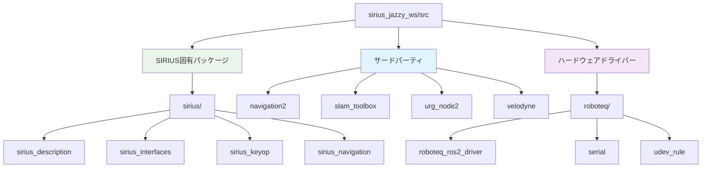

# SIRIUS Jazzy Workspace

このワークスペースは、SIRIUSロボットのROS 2 Jazzy環境用の開発環境です。

## クローン方法

### 通常のクローン
```bash
git clone --recurse-submodules https://github.com/YakiFrog/sirius_jazzy_ws.git
```

### プライベートサブモジュールがある場合
一部のサブモジュールがプライベートリポジトリのため、以下のいずれかが必要です：

#### SSH認証を使用する場合
```bash
# SSH鍵の設定後
git clone --recurse-submodules git@github.com:YakiFrog/sirius_jazzy_ws.git
```

#### 段階的にクローンする場合
```bash
# 1. メインリポジトリをクローン
git clone https://github.com/YakiFrog/sirius_jazzy_ws.git
cd sirius_jazzy_ws

# 2. 認証設定後、サブモジュールを更新
git submodule update --init --recursive
```

## 概要

このワークスペースには、SIRIUSロボットの自律ナビゲーション、センサー統合、および制御に必要なパッケージが含まれています。

## srcフォルダ内のパッケージ


```mermaid
graph TD
    A[sirius_jazzy_ws/src] --> B[SIRIUS固有パッケージ]
    A --> C[サードパーティ]
    A --> D[ハードウェアドライバー]
    
    B --> B1[sirius/]
    B1 --> B1A[sirius_description]
    B1 --> B1B[sirius_interfaces]
    B1 --> B1C[sirius_keyop]
    B1 --> B1D[sirius_navigation]
    
    C --> C1[navigation2]
    C --> C2[slam_toolbox]
    C --> C3[urg_node2]
    C --> C4[velodyne]
    
    D --> D1[roboteq/]
    D1 --> D1A[roboteq_ros2_driver]
    D1 --> D1B[serial]
    D1 --> D1C[udev_rule]
    
    style B fill:#e8f5e8
    style C fill:#e1f5fe
    style D fill:#f3e5f5
```

### SIRIUS固有パッケージ (`sirius/`)
- **sirius_description**: SIRIUSロボットのURDF/Gazeboモデル
- **sirius_interfaces**: カスタムメッセージとアクション定義
- **sirius_keyop**: キーボード操作用のテレオペレーションパッケージ
- **sirius_navigation**: SIRIUS固有のナビゲーション設定とランチファイル

### サードパーティパッケージ
- **navigation2**: ROS 2の公式ナビゲーションスタック
- **slam_toolbox**: SLAMとマッピング機能を提供
- **urg_node2**: Hokuyo URGレーザースキャナードライバー
- **velodyne**: Velodyneライダーセンサードライバー

### ハードウェアドライバー (`roboteq/`)
- **roboteq_ros2_driver**: Roboteqモータードライバー本体
- **serial**: シリアル通信ライブラリ
- **udev_rule**: udevルール設定

## ビルド手順

```bash
# ワークスペースのルートディレクトリで実行
colcon build --symlink-install
```

## 使用方法

```bash
# 環境設定
source install/setup.bash

# 基本的なナビゲーション起動
ros2 launch sirius_navigation navigation.launch.py
```

## モーター制御および速度限界（roboteq_ros2_driver）

対向2輪キャスター型（差動二輪）の特性および現在のパラメータ設定に基づいて、ロボットの指令速度（線速度 $v$・角速度 $\omega$）には以下の物理的限界があります。

### パラメータ設定値
- **トレッド幅** $T = 0.40 \text{ m}$
- **車輪の円周** $C = 0.825 \text{ m}$
- **速度スケーリング係数** $S = 0.52$
- **モーターの最大回転数** $N_{\max} = 58 \text{ RPM}$

### 限界条件式
指令する線速度 $v \text{ [m/s]}$ と角速度 $\omega \text{ [rad/s]}$ に対し、モータードライバへ送る出力コマンド（$-1000$ 〜 $1000$ デューティ比）が飽和（100%出力）しないための境界条件式は以下のようになります：

$$-1.53 \le v \pm 0.20 \omega \le 1.53 \text{ [m/s]}$$

これに基づき、以下の制限が発生します：

1. **直進時の最大線速度（$\omega = 0$）**
   - 最大線速度 $v_{\max} \approx 1.53 \text{ m/s}$
   - 指令値として $2.0 \text{ m/s}$ を送っても、モーター出力が $100\%$（`1000`）で飽和するため、物理的に $1.5 \text{ m/s}$ 付近で頭打ちになります。
2. **その場旋回時の最大角速度（$v = 0$）**
   - 最大角速度 $\omega_{\max} \approx 7.65 \text{ rad/s}$
3. **複合走行時の制限（前進しながらの旋回）**
   - 線速度と角速度はお互いの出力を制限し合います。
   - 例：$1.0 \text{ m/s}$ で前進中に出せる角速度は最大 $\approx 2.65 \text{ rad/s}$ に制限されます。最高速度の $1.5 \text{ m/s}$ で直進している最中は、旋回に必要な追加の出力を得られないため、ほぼ曲がることができません。

## 注意事項

- `src`フォルダはgitignoreで除外されているため、パッケージの詳細な更新情報は各パッケージのREADMEを参照してください
- このワークスペースはROS 2 Jazzy環境での使用を前提としています