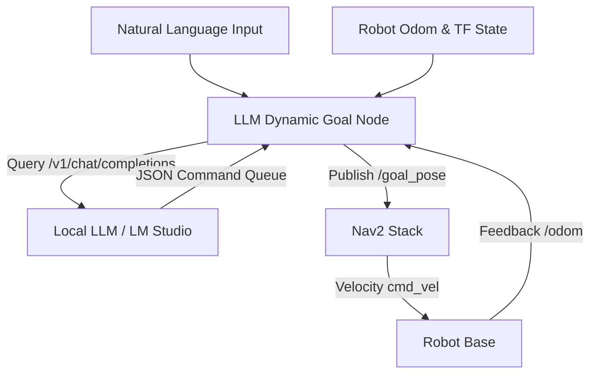

# LLM Dynamic Goal Node (`llm_dynamic_goal.py`) Documentation

This documentation explains the design, architecture, and usage of the **LLM Dynamic Goal Node** which integrates Large Language Models (LLMs) with ROS 2 Nav2 for natural language robot navigation.

## Repository Location

- **Source Code**: [llm_dynamic_goal.py](../../src/sirius/sirius_navigation/sirius_navigation/llm_dynamic_goal.py)
- **Start Script**: [llm_dynamic_goal.sh](../../bash/startup_bash/llm_dynamic_goal.sh)

---

## 1. Key Architectural Concepts



### 1.1 State-Feedback Loop
The node subscribes to `/odom` and queries `tf` (`map` -> `sirius3/base_footprint`) to maintain a real-time record of the robot's coordinates, velocities, and rotation. This information is dynamically injected into the system prompt of the LLM on every query as the `【Robot Current Hardware State Feedback】` block.

This enables:
- **Autonomous Obstacle Detection**: If translation or rotation remains stagnant for 5 seconds while a command is executing, the node flags a physical stuck state, cancels the current Nav2 goal, and notifies the LLM.
- **Contextual Self-Correction**: When the user complains (e.g. "not moving at all" or "failed"), the LLM inspects the blockage history in the conversation context and proposes detours or backup recovery steps.

### 1.2 Multi-Turn Command Sequencer
The node supports sequential action execution (e.g. "Go forward 3m, then turn left 90 degrees"). 
Instructions are translated by the LLM into a JSON array of commands:
```json
{
  "commands": [
    {"type": "forward", "value": 3.0},
    {"type": "turn", "value": 1.5708}
  ],
  "cancel": false
}
```
The node maintains a command queue (`self.command_queue`) and sequentially processes them.

---

## 2. Dynamic Carrot Rotation Control (Crucial Logic)

To achieve clean **in-place rotation** without translating, and to prevent Nav2 from stuttering or slowing down due to goal proximity, the node implements a **Dynamic Carrot Rotation** algorithm running at **5Hz**:

1. **Target Distance ($R = 1.1\text{m}$)**:
   The goal is always placed $1.1\text{m}$ away from the robot. This forces the Nav2 controller to maintain high angular velocity instead of decelerating as if it were close to the destination.
2. **Carrot Tracking ($\theta = \text{クランプされた残角度}$)**:
   The remaining angle to rotate is continuously tracked using high-frequency odometry integration:
   $$\Delta \text{yaw} = \text{yaw}_{\text{robot}} - \text{yaw}_{\text{last}}$$
   $$\theta_{\text{remaining}} \leftarrow \theta_{\text{remaining}} - \Delta \text{yaw}$$
   The target angle $\theta_{\text{carrot}}$ is set to $\theta_{\text{remaining}}$, clamped to $[-70^\circ, 70^\circ]$. The goal coordinate in the map frame is dynamically recalculated at 5Hz:
   $$X_{\text{goal}} = X_{\text{robot}} + 1.1 \cos(\text{yaw}_{\text{robot}} + \theta_{\text{carrot}})$$
   $$Y_{\text{goal}} = Y_{\text{robot}} + 1.1 \sin(\text{yaw}_{\text{robot}} + \theta_{\text{carrot}})$$
   Because the goal translates dynamically as the robot shifts, the robot does not move linearly and rotates cleanly in place.
3. **High-Precision Early Exit ($< 8^\circ$)**:
   When the remaining angle drops below $8^\circ$ ($0.14\text{ rad}$), the node cancels the active Nav2 goal without resetting the command queue (`cancel_navigation(clear_queue=False)`) and immediately executes the next command.

---

## 3. Supported Natural Language Commands

The node translates natural language instructions into the following motion commands:

| Command Type | Description | JSON Example |
|---|---|---|
| `forward` | Moves forward by the specified distance (meters). | `{"type": "forward", "value": 1.5}` |
| `backward` | Moves backward by the specified distance (meters). | `{"type": "backward", "value": 0.5}` |
| `turn` | Rotates relative to the current heading (radians). Positive=Left, Negative=Right. | `{"type": "turn", "value": -1.5708}` |
| `spin` | Rotates in-place by the specified degrees. 0=360° spin. | `{"type": "spin", "value": 360}` |
| `face` | Turns to face an absolute map direction (compass). 90=North, -90=South, 0=East, 180=West. | `{"type": "face", "value": 90}` |
| `goto` | Navigates to absolute map coordinates `[x, y]`. | `{"type": "goto", "value": [0.0, 0.0]}` |

---

## 4. Setup and Run Instructions

### 4.1 Prerequisites
1. **LM Studio**: Run LM Studio locally on port `1234` and load the LLM model (e.g. `gemma-2-9b-it`).
2. **ROS 2 Workspace**: Make sure `sirius_navigation` is built and sourced.

### 4.2 How to Run
Use the startup script or the launch alias:

```bash
# Sourcing the environment
source $HOME/sirius_jazzy_ws/install/setup.bash

# Run using script
bash $HOME/sirius_jazzy_ws/bash/startup_bash/llm_dynamic_goal.sh

# Or run using bash alias (if source bash_alias2.sh is loaded)
llm_goal
```
