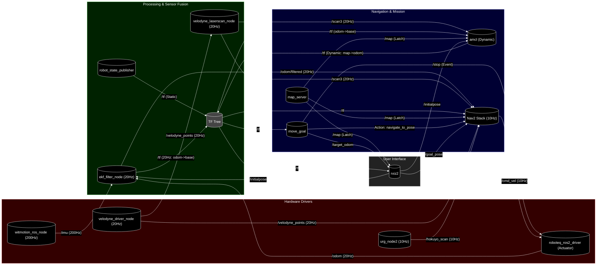

# Sirius System Diagram (Real Robot)

This diagram represents the node interactions when running `sirius_jazzy_ws` on the real hardware (Jazzy/ROS 2).

## ノードの詳細説明

- **roboteq_ros2_driver**: 20Hzでオドメトリ配信、10Hzで速度指令受信。
- **urg_node2**: 約10Hzで `/hokuyo_scan` を配信。
- **velodyne_driver_node**: 約20Hzで `/velodyne_points` を配信。
- **witmotion_ros_node**: 200Hzの高周期で `/imu` を配信。
- **velodyne_laserscan_node**: 20Hzで点群を `/scan3` に変換。
- **ekf_filter_node**: 20Hzでセンサを統合し `/odom/filtered` を出力。
- **robot_state_publisher**: URDFから静的な `/tf` を配信。
- **amcl**: 移動時のみ補正を実施。
- **nav2_stack**: 10Hz周期でパス追従と制御を実施。
- **move_goal**: 2秒周期でウェイポイント巡回を管理。
