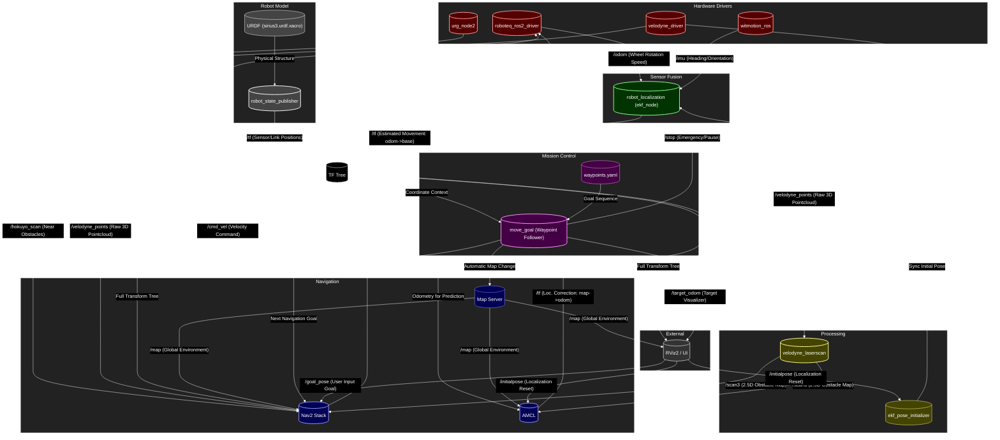

# Sirius System Diagram (Real Robot)

This diagram represents the node interactions when running `sirius_jazzy_ws` on the real hardware (Jazzy/ROS 2).

## ノードの詳細説明

### ハードウェアドライバ (Hardware Drivers)
- **roboteq_ros2_driver**: モーター制御を担当します。
  - **Subscribes**: `/cmd_vel`（速度指令を受信）
  - **Publishes**: `/odom` (ホイールオドメトリ/生の車輪回転情報), `/tf` (EKF使用時は通常無効化)
- **URG (urg_node2)**: Hokuyo LiDARのドライバです。
  - **Publishes**: `/hokuyo_scan`（周囲の2D障害物データ。Local Costmapで使用）
- **velodyne_driver**: 3D LiDAR (Velodyne) のドライバです。
  - **Publishes**: `/velodyne_points` (3D点群データ)
- **witmotion_ros**: IMU/AHRS（姿勢センサ）のドライバです。
  - **Publishes**: `/imu` (方位/Yaw角、センサフュージョンに使用)

### ロボットモデル (Robot Model)
- **robot_state_publisher**: URDF（ロボットの設計図）から静的な座標変換（TF）を配信します。
  - **Inputs**: `URDF` (sirius3.urdf.xacro)
  - **Publishes**: `/tf` (静的TF: `base_link` → 各センサへの座標変換)

### データ処理 (Processing)
- **velodyne_laserscan**: 3D点群を2次元（2.5次元）のレーザースキャンデータに変換します。
  - **Subscribes**: `/velodyne_points`
  - **Publishes**: `/scan3`（AMCLが自己位置を見失わないよう、特徴的な高さを抽出した仮想スキャン）
- **ekf_pose_initializer**: RVizからの初期位置（/initialpose）をEKFに同期させる橋渡しをします。
  - **Subscribes**: `/initialpose`
  - **Calls**: `/ekf_filter_node/set_pose` (Service)

### センサフュージョン (Sensor Fusion)
- **ekf_node**: `robot_localization` パッケージを使用してデータを統合します。
  - **Inputs**: 
    - `/odom` (車輪からの速度情報)
    - `/imu` (IMUからの方位/Yaw情報)
  - **Outputs**:
    - `/odometry/filtered`: 統合された滑らかな自己位置推定データ。
    - `/tf`: `odom` フレームから `base_footprint` フレームへの座標変換。

### ミッション管理 (Mission Control)
- **move_goal**: ウェイポイント（経由地）を逐次的に読み込み、Nav2に移動指令を出します。
  - **Inputs**: 
    - `waypoints.yaml` (目標地点のリスト)
    - `/tf` (ロボットの現在位置を確認)
  - **Outputs**:
    - `/target_odom`: **目標地点の可視化。** RViz上で「次にどこへ向かおうとしているか」をゴーストとして表示するために使用します。
  - **Actions**: `navigate_to_pose` (Nav2へ目標地点を送信)
  - **Features**: 到着判定後の次地点送信、地図切り替えの自動化。

### ナビゲーション (Navigation / Nav2)
- **Map Server**: 地図ファイル（.yaml / .pgm）を読み込み、配信します。
  - **Publishes**: `/map`
- **Nav2 Stack**: 経路計画と制御（自律走行の中核）を行います。内訳として `Planner`, `Controller`, `BT Navigator` 等を含みます。
  - **Inputs**: 
    - `/odometry/filtered`（自己位置）
    - `/scan3`（Velodyne由来の2.5Dスキャン）
    - `/hokuyo_scan`（URG由来の2Dスキャン）
    - `/velodyne_points`（Velodyneの3D点群）
    - `/map`（地図情報）
    - `/goal_pose`（RVizからの目的地）
  - **Outputs**: `/cmd_vel`（モーターへの移動指令）

### 外部インターフェース (External)
- **RViz2**: ロボットの状態を可視化し、指示を与えます。
  - **Publishes**: `/goal_pose` (目的地), `/initialpose` (初期位置)
  - **Subscribes**: `/map`, `/tf`, 各種デバッグ情報

### 自己位置推定 (Localization)
- **AMCL**: マップベースの自己位置推定（モンテカルロ位置推定）を行います。
    - **Inputs**:
        - `/scan3` (Velodyne由来の2.5次元スキャンデータ): 地図との照合に使用。
        - `/tf` (odom → base_footprint): オドメトリ（ロボットの相対移動量）として使用。スキャン更新の間にロボットがどれくらい動いたかを予測します。
    - **Outputs**: `/tf` (map → odom 間の補正変換)
