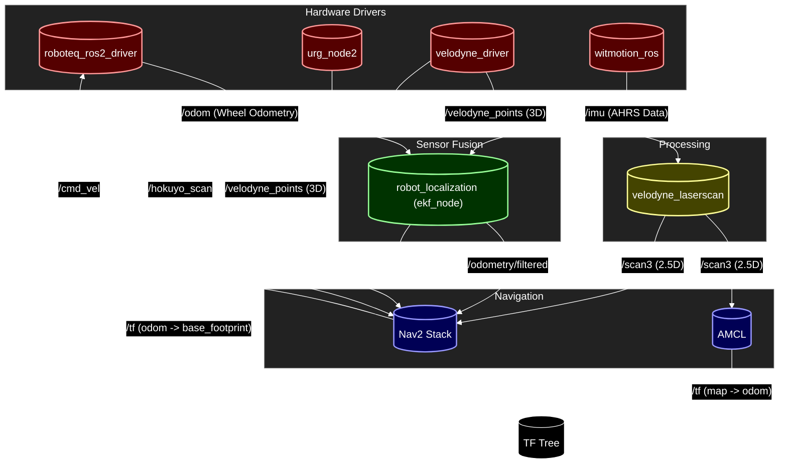

# Sirius System Diagram (Real Robot)

This diagram represents the node interactions when running `sirius_jazzy_ws` on the real hardware (Jazzy/ROS 2).

## ノードの詳細説明

### ハードウェアドライバ (Hardware Drivers)
- **roboteq_ros2_driver**: モーター制御を担当します。
  - **Subscribes**: `/cmd_vel`（速度指令を受信）
  - **Publishes**: `/odom` (ホイールオドメトリ/生の車輪回転情報), `/tf` (EKF使用時は通常無効化)
- **URG (urg_node2)**: Hokuyo LiDARのドライバです。
  - **Publishes**: `/hokuyo_scan`（周囲の2D障害物データ。Local Costmapで使用）
- **velodyne_driver**: 3D LiDAR (Velodyne) のドライバです。
  - **Publishes**: `/velodyne_points` (3D点群データ)
- **witmotion_ros**: IMU/AHRS（姿勢センサ）のドライバです。
  - **Publishes**: `/imu` (方位/Yaw角、センサフュージョンに使用)

### データ処理 (Processing)
- **velodyne_laserscan**: 3D点群を2次元（2.5次元）のレーザースキャンデータに変換します。
  - **Subscribes**: `/velodyne_points`
  - **Publishes**: `/scan3`

### センサフュージョン (Sensor Fusion)
- **ekf_node**: `robot_localization` パッケージを使用してデータを統合します。
  - **Inputs**: 
    - `/odom` (車輪からの速度情報)
    - `/imu` (IMUからの方位/Yaw情報)
  - **Outputs**:
    - `/odometry/filtered`: 統合された滑らかな自己位置推定データ。
    - `/tf`: `odom` フレームから `base_footprint` フレームへの座標変換。

### ナビゲーション (Navigation / Nav2)
- **Nav2 Stack**: 経路計画と制御を行います。
  - **Inputs**: 
    - `/odometry/filtered`（自己位置）
    - `/scan3`（Velodyne由来の2.5Dスキャン。Global Costmap等で使用）
    - `/hokuyo_scan`（URG由来の2Dスキャン。Local Costmapで使用）
    - `/velodyne_points`（Velodyneの3D点群。Local Costmap STVLで使用）
    - `/map`（地図）
  - **Outputs**: `/cmd_vel`（モーターへの移動指令）

### 自己位置推定 (Localization)
- **AMCL**: マップベースの自己位置推定（モンテカルロ位置推定）を行います。
    - Velodyneから変換された `/scan3` トピック（2.5次元スキャンデータ）と地図を照合して、マップ内でのグローバルな位置を特定します。
    - **Outputs**: `/tf` (map -> odom 間の補正変換)
