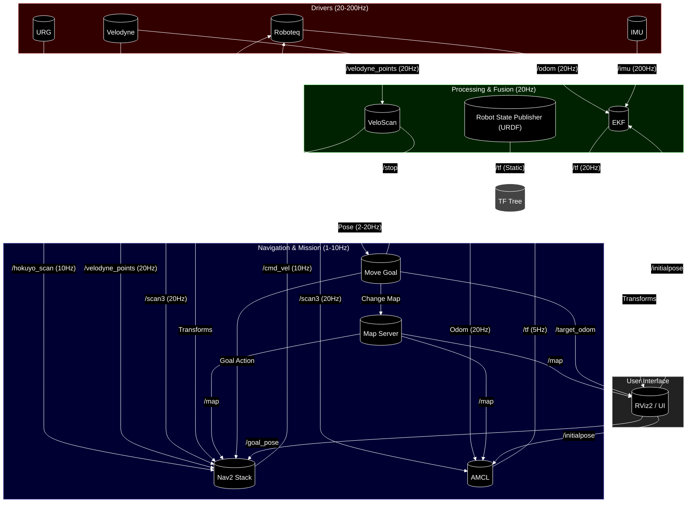

# Sirius System Diagram (Real Robot)

This diagram represents the node interactions when running `sirius_jazzy_ws` on the real hardware (Jazzy/ROS 2).

## ノードの詳細説明

- **Roboteq**: 20Hzでオドメトリを配信、10Hzで速度指令を受信。
- **URG**: 約10Hzで周辺スキャンを配信。
- **Velodyne**: 約20Hzで3D点群を配信。
- **IMU**: 200Hzの高周期で姿勢情報を配信。
- **VeloScan**: 20Hzで3D点群を仮想2.5Dスキャンに変換。
- **EKF**: 20Hzでセンサーを統合。
- **AMCL**: 5Hz程度（移動時）で自己位置を補正。
- **Nav2**: 10Hzの制御ループで動作。
- **Move Goal**: 0.5Hz（2秒周期）で到達判定と次目標送信。
