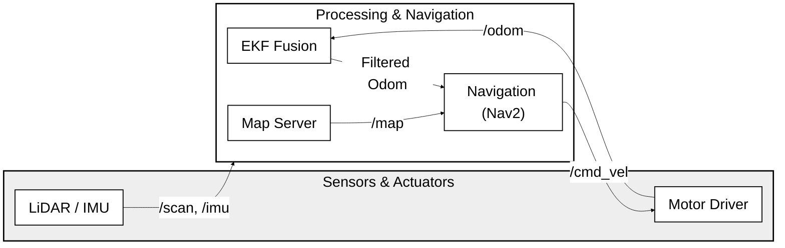

# Sirius System Diagram (Academic/Paper Version)

This version is optimized for white-background publications (papers, reports). It features large text and high contrast for maximum readability.

## 論文・レポート用設定
- **高コントラスト**: 白背景に黒文字・黒線で、印刷時やPDF閲覧時の視認性を最大化しています。
- **特大フォント**: `fontSize: 24px` に設定し、論文内で図を縮小して配置しても文字が潰れないように工夫しています。
- **ノード名称の簡略化**: スペースを節約しつつ正確性を保つため、プロセスの実行ファイル名に近い名称を採用しています。
- **モノクロスタイル**: 色を多様せず、薄いグレーの塗りつぶしのみを使用することで、上品でアカデミックな外観にしています。
