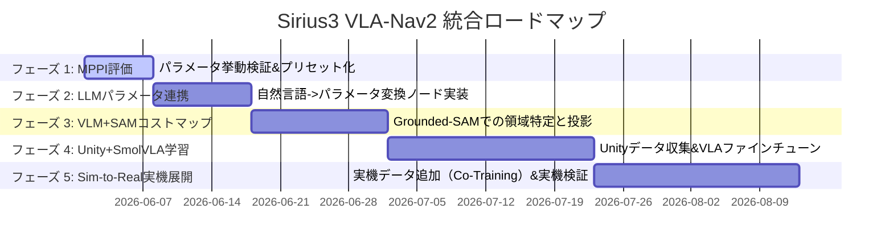

# VLA (Vision-Language-Action) と Nav2 (MPPI) の統合に向けた技術検討と今後の展望

本ドキュメントでは、Sirius3 のナビゲーションシステムに VLA (Vision-Language-Action) または VLM (Vision-Language Model) を導入し、人の自然言語指示に対して柔軟かつ安全に動作させるための統合アーキテクチャおよび今後の展望についてまとめます。

---

## 1. 意思決定の背景と基本方針：完全VLA vs ハイブリッド（VLA + Nav2 MPPI）

言語指示から直接ロボットの制御信号（`cmd_vel` 等）を出力する「完全なエンドツーエンド VLA」と、高レベルな判断を VLA/VLM が行い、低レベル制御（衝突回避や軌道生成）を「Nav2 + MPPI」に任せる「ハイブリッド方式」の比較です。

### 比較表

| 評価項目 | ① 完全エンドツーエンド VLA (`Instruction + Image -> cmd_vel`) | ② ハイブリッド方式 (VLA/VLM/LLM -> Nav2 MPPI) |
| :--- | :--- | :--- |
| **安全性・衝突回避** | ❌ 危険。ニューラルネットワークの出力に依存するため、100%の衝突回避保証が困難。 | ⭕ 安全。Nav2のコストマップとMPPIのハードウェア制約/衝突判定フィルタが動作するため安全。 |
| **制御周期 (Hz)** | ❌ 遅い (VLAの推論は通常数Hz〜十数Hz程度、エッジではさらに低速)。 | ⭕ 速い。高レベルプランニングは低頻度、MPPIによる局所プランニングは 20Hz 以上のリアルタイム制御。 |
| **学習・構築コスト** | ❌ 非常に高い。膨大なデモデータや強化学習、実機でのファインチューニングが必要。 | ⭕ 低〜中。既存のNav2スタックと事前学習済みのVLM/LLMをAPIまたはローカル推論で統合可能。 |
| **指示への柔軟性** | ⭕ 極めて高い。明示的な地図がない未知の環境でも視覚と言語の関連付けで動作可能。 | 🔺 中〜高。指示を中間目標（ウェイポイント、セマンティック目標、進入禁止エリア等）に翻訳してNav2に渡す。 |

### 結論と推奨アプローチ
**「② ハイブリッド方式 (VLA/VLM -> Nav2 MPPI)」の採用を強く推奨します。**
ロボットの自律移動において「絶対に衝突しないこと」「リアルタイムに自己位置を推定し制御周期を保つこと」は必須です。これらを信頼性の高い Nav2 (MPPI) に委ねつつ、人の曖昧な指示の解釈や環境の文脈理解（例：「あそこの赤い椅子の横を通って」）を VLA/VLM が担う構成が最も現実的かつ強力です。

---

## 2. MPPI パラメータ調整による「移動ニュアンス」の動的制御

Nav2 の **MPPI (Model Predictive Path Integral) コントローラー**は、予測期間内の複数の制御候補から最適な経路を評価関数（Critic）に基づいて決定します。
この評価関数の重み（パラメータ）を VLM/LLM が指示に応じて動的に書き換えることで、ロボットの「歩き方（動作のニュアンス）」を柔軟に変化させることができます。

### 指示内容に応じた MPPI パラメータ調整の例

| 指示のニュアンス | 調整対象の MPPI パラメータ | 期待される効果 |
| :--- | :--- | :--- |
| **「急いで向かって」** | `max_vel_x` 増加 / `ReferenceTrajectoryCost` 重み強化 | 直線的な経路を高速で移動する |
| **「狭いから注意して進んで」** | `ObstacleCost` 重み強化 / `max_vel_x` 低下 / 予測ステップ数 `time_steps` 増加 | 障害物から十分な距離を取り、慎重に減速しながら進む |
| **「人に優しく避けて」** | `PathAlignCost` 緩和 / `ObstacleCost` 範囲拡大 | 人を大回りして避ける（マナーを重視した軌道） |
| **「元のルートを忠実に守って」** | `PathAlignCost` 重み強化 / `GoalAngleCost` 重み強化 | グローバルパスから外れずに、指定ルートを正確にトレースする |

### 実装イメージ (ROS 2 パラメータの動的更新)
VLM/LLM が自然言語を解析し、適切なパラメータセット（YAML形式など）を判定。ROS 2 のパラメータクライアント機能（`ros2 param set /controller_server ...`）を用いて動的に MPPI の挙動を書き換えます。

---

## 3. 提案アーキテクチャ (Hybrid VLA-Nav2)

```mermaid
graph TD
    A[ユーザーの自然言語指示] --> B[VLM / LLM Planner]
    C[カメラ画像 / センサ情報] --> B
    
    B -->|1. セマンティック目標位置 / ウェイポイント| D[Nav2 Navigator / BT]
    B -->|2. コストマップ動的更新 (進入禁止領域など)| E[Nav2 Costmap 2D]
    B -->|3. 指示のニュアンスに応じた制御パラメータ| F[Nav2 MPPI Controller]
    
    D --> F
    E --> F
    F -->|cmd_vel (20Hz+)| G[Sirius3 ロボット本体 / シミュレータ]
```

### 各コンポーネントの役割
1. **VLM/LLM Planner (高レベル脳)**
   - ユーザーの「会議室Aの奥にある机の前に移動して、その際、廊下にいる人を刺激しないように静かに進んで」といった複雑な指示を解釈。
   - カメラ画像と地図から、目標となる座標（セマンティック・ウェイポイント）を特定。
   - 「静かに進んで」から MPPI の速度制限パラメータを生成。
2. **Nav2 Navigator (中レベル行動制御)**
   - 挙動木（Behavior Tree）を用いて、グローバルパス計画やスタック時のリカバリー行動を担当。
3. **Nav2 MPPI (低レベルリアルタイム制御)**
   - 局所的なパス生成、障害物回避。
   - 動的に更新されたパラメータに従い、指示に応じたスタイルで自律移動を実行。

---

## 4. 今後の展望・ロードマップ

段階的に実装と検証を進めることを提案します。

### フェーズ 1: MPPI パラメータの挙動確認と手動切り替え（即時着手可能）
- MPPI の主要パラメータ（速度、衝突回避コスト、経路追従コスト）を変更した際、シミュレータ上で Sirius3 の移動ニュアンスがどう変わるかをプロット・評価する。
- プリセット（例：`normal`, `cautious` (慎重), `fast` (高速)）を作成し、CLI から動的に切り替えて追従性を確認する。

### フェーズ 2: 自然言語からパラメータへの変換モジュール (LLM-based Parameter Adjuster)
- ローカル LLM または API（Ollama, GPT, Gemini 等）を用い、ユーザの自由入力テキストから MPPI パラメータの調整値（JSON/YAML）を出力するプロンプト・推論ノードを ROS 2 パッケージとして実装。
- 例: `"静かに進んで"` -> `{"max_vel_x": 0.3, "obstacle_cost_power": 2.0}`

### フェーズ 3: VLM を用いた Visual Grounding / セマンティックナビゲーションの統合
- カメラ画像を入力とし、地図上の絶対座標ではなく「青い椅子の前」などの相対的な視覚的目標物を同定する。
- 同定した座標を Nav2 の Goal ポーズとして送信し、自律移動を達成する。

---

## 5. VLMにおける「連続的な指示・出力」の実現性と手法

VLA（Vision-Language-Action）モデルは制御アクション（速度や手先位置など）を直接出力するように設計されていますが、一般的な VLM（Vision-Language Model）で連続的な指示や制御を行いたい場合、その特性と遅延（レイテンシ）を考慮する必要があります。

### VLM と VLA の「連続性」の比較

| 特性 | VLA (Vision-Language-Action) | VLM (Vision-Language Model) |
| :--- | :--- | :--- |
| **出力フォーマット** | 数値ベクトル（速度・デルタ位置など） | テキスト、バウンディングボックス、座標トークン |
| **推論速度 (周波数)** | 比較的速い (数Hz 〜 20Hz程度) | 遅い (数Hz未満、トークン生成のため 200ms〜数秒) |
| **制御への適用方法** | 直接 `cmd_vel` 等にマッピング可能 | **直接の連続制御は困難**。状態フィードバックによる間接制御。 |

### VLMで「連続的な指示・フィードバック」を実現する3つのアプローチ

一般的なVLMの出力速度（遅さ）をカバーしつつ、連続的に指示・修正を与え続けるには、以下のハイブリッドなアーキテクチャが有効です。

#### 1. アクション・チャンキング (Action Chunking) / 軌道予測出力
VLMに単一の制御値（現在の `cmd_vel`）を出力させるのではなく、**「数秒先までの目標軌道のシーケンス（Waypointsの集合）」を一度にまとめて出力**させます。
- **仕組み**: VLMは「次の10ステップの移動軌道」を予測し、Nav2（MPPI）に渡します。Nav2はその軌道を滑らかに追従します。その間にVLMは次の軌道を並列で推論し、軌道を滑らかに更新（オーバーラップ）し続けます。

#### 2. イベント駆動・クエリ型フィードバックループ (0.5Hz 〜 2Hz)
VLMによる画像・言語のコンテキスト理解は常時（20Hzなど）行う必要はありません。低頻度で画像監視を行い、経路の修正指示を連続的にNav2へ送信します。
- **例**: 1秒に1回、前方画像と指示をVLMに投げて「ユーザーは『あの人の右側を通って』と言っているが、現在の経路は適切か？」を検証。不適切であれば、動的に進入禁止領域（Costmap）やMPPIのパラメータを書き換えて制御を補正します。

#### 3. VLM（検出・指示） ＋ 高速トラッカー（追従）の分離
VLMで目標（オブジェクトや経路の方向）を一度特定した後は、VLMの推論を止め、軽量な追跡アルゴリズム（例：SAM 2、境界ボックス追跡、または単一オブジェクトトラッカー）にバトンタッチして、実時間（30Hz以上）でその目標を追いかけます。
- VLM：「あの赤いカバンの場所へ行って」 ➡ 赤いカバンを画像上で検出（VLM）。
- トラッカー：カバンの画像上の位置を30Hzで追従し、3D座標を計算してNav2へ送り続ける。

---

## 6. Gemma を用いた「自己回帰のデメリット克服」と SmolVLA との比較

ユーザーが **Gemma 2B** や **PaliGemma** などのVLMベースモデルを採用する場合、自己回帰（テキストトークンを1つずつ生成する処理）に伴う低周波数・高遅延をいかに克服するかが課題となります。

### 自己回帰のデメリットを克服する2つの主要アプローチ

#### A. Continuous Action Head (非自己回帰ヘッド) の追加（SmolVLA方式）
Gemma の最終デコーダーヘッドを取り外し、その上に **Diffusion Policy（拡散ポリシー）** や **Flow Matching（フローマッチング）**、あるいはシンプルな **MLP/Transformerベースのアクションヘッド** を結合します。
- **仕組み**: Gemma を「画像と指示文をエンコードする特徴抽出器（Backbone）」として扱い、最後の隠れ状態（Hidden States）をアクションヘッドに入力します。
- **メリット**: テキストトークンを1個ずつ生成するのではなく、**1回の順伝播（Forward Pass）で数秒先までの連続的な行動軌道（Action Chunk）を直接出力**できるため、自己回帰ループが不要になり、推論速度が劇的に向上します。

#### B. レイヤー・プルーニング (レイヤー削減)
Gemma の全レイヤーを通すと推論コストが高いため、下位の数層（例: 最初の12〜16層）のみを「Vision-Language エンコーダー」として切り出し、上位レイヤーをスキップしてアクションヘッドに直結します。これにより、メモリ使用量と演算量を半分以下に削減できます。

---

### SmolVLA との比較

**SmolVLA** は、Hugging FaceのLeRobotチームが開発した超軽量なVLAモデル（約450Mパラメータ）であり、上記のアプローチを極限まで最適化して実装した好例です。

| 評価軸 | 標準の Gemma 2B / PaliGemma 3B をそのまま使う場合 | SmolVLA (LeRobot) |
| :--- | :--- | :--- |
| **アーキテクチャ** | 完全自己回帰（テキスト/数値トークン生成） | **VLMバックボーン (SmolVLM-2ベース 16層削減版)** + **Flow Matching (Action Expert)** |
| **出力形式** | テキスト（例: `"[0.1, 0.0, 0.2]"` のような文字出力） | **連続値（1回の推論で将来のアクションチャンクを出力）** |
| **制御周波数** | ❌ 極めて遅い (0.5Hz 〜 2Hz程度) | ⭕ 高速 (非自己回帰のため、エッジGPUでも実用的な制御周期を維持可能) |
| **ロボティクス適合性** | 🔺 汎用知識は高いが、ミリ単位の空間認識やロボットの固有状態（Proprioception）の融合には追加学習が必須。 | ⭕ 最初から Open X-Embodiment 等のロボット操作データセットでファイントレーニング済み。 |
| **リソース要件** | 2B/3BクラスのGPUメモリ (数GB) だが、推論負荷が高い。 | 450Mまで軽量化されており、コンシューマーGPUや一部のCPU環境でも動作可能。 |

### 結論：どちらを選ぶべきか？

- **SmolVLA のメリット**:
  すでにロボット用に極限まで最適化（レイヤー削減、画像トークンの圧縮、Flow Matchingによる連続出力、非同期制御キュー）されており、**「すぐに動く軽量なVLA」を求めている場合は圧倒的にSmolVLAが有利**です。
- **Gemma / PaliGemma の自作統合**:
  「Sirius3 独自のタスク（より複雑な言語推論やドキュメント解釈を組み合わせたい）」などで、Gemmaの持つ強力な汎用推論能力・言語理解能力を活かしたい場合に向いています。この場合、Gemmaを特徴抽出器として固定（Freeze）し、その上に自作の軽量アクションデコーダーを繋げてファインチューニングする構成になります。

---

## 7. LM Studio の制約と PyTorch での開発移行について

LM Studio は非常に便利な推論ツールですが、今回の「デコーダーを取り外してアクションヘッド（Diffusion Policy等）を結合する」といったVLA構築を行う上では、以下の制約があります。

### LM Studio (および GGUF / llama.cpp) を使う場合の制約
* **ネットワーク構造の改造は不可**: LM Studio はコンパイル済みのモデルファイル（GGUF等）をロードし、事前定義されたテキスト生成（自己回帰）のAPIを提供するサーバーです。内部の重みテンソルを取り出したり、最終層を切り取って別のニューラルネットワークを PyTorch 等で結合して学習させるといったことはできません。
* **LM Studioでできる限界**: 
  テキストのやり取りしかできないため、プロンプトで出力を厳密にフォーマットし、**「数秒分の目標座標（アクションチャンク）を表すJSONテキスト」**を出力させ、それをPython側でパースしてROS 2に投げる方法になります（前述の「アクション・チャンキング」アプローチ）。

### デコーダーを実際に取り外してVLAを構築する方法 (PyTorch への移行)
実際にデコーダーを改造・結合したり、モデルのファインチューニングを行う場合は、**Python + PyTorch + Hugging Face Transformers** の環境でコードを書く必要があります。

1. **Pythonでのモデル読み込み**:
   ```python
   from transformers import GemmaModel, GemmaForCausalLM
   
   # 言語生成用のヘッド(lm_head)を含まない、ベース特徴抽出器のみをロード
   base_gemma = GemmaModel.from_pretrained("google/gemma-2-2b")
   ```
2. **カスタムアクションヘッドの結合**:
   `GemmaModel` は、テキストや画像を入力すると、最後の隠れ状態（Hidden States: 各トークンの特徴ベクトル）を出力します。この出力を、自分で定義した PyTorch の別モジュール（MLP や Diffusion Head）に入力します。
   ```python
   import torch.nn as nn

   class GemmaVLA(nn.Module):
       def __init__(self, base_gemma):
           super().__init__()
           self.backbone = base_gemma  # 特徴抽出器としてGemmaを使用
           self.action_head = nn.Sequential(
               nn.Linear(2048, 512),   # Gemma-2Bの隠れ層次元数2048からマッピング
               nn.ReLU(),
               nn.Linear(512, 10)      # 例: 10ステップ先までの連続速度ベクトル
           )
           
       def forward(self, input_ids):
           outputs = self.backbone(input_ids=input_ids)
           last_hidden_state = outputs.last_hidden_state[:, -1, :] # 最後のトークンの特徴量
           actions = self.action_head(last_hidden_state)
           return actions
   ```
3. **学習 (Fine-tuning)**:
   このカスタムモデルに対して、ロボットの動作ログ（画像、指示、正解のアクションシーケンス）を入力し、アクションヘッドの重みを学習（必要に応じてGemma本体をLoRA等で同時に微調整）します。

---

## 8. カスタム VLA 構築の潮流と「学習（トレーニング）」の必要性について

自作の VLA を構築するアプローチや、その際に必要となる学習コスト・データ収集について解説します。

### A. カスタム VLA 構築の取り組みはよくあるか？
**ロボティクスおよび Embodied AI（身体性AI）のR&D領域では、現在最も活発に行われている取り組みの一つです。**
* **研究・開発のトレンド**: Google DeepMind の **RT-2**、オープンソースの **OpenVLA** や **Octo**、そして Hugging Face の **SmolVLA** など、既存の強力な VLM（PaliGemma, LLaVA, SmolVLM 等）をベースにして、アクションデコーダーを後付けする手法がデファクトスタンダード（標準）になっています。
* **実用レベルでのアプローチ**: ゼロから VLA を作るのは膨大な計算資源とデータが必要なため、通常は **「公開されているオープンソースの VLA (OpenVLA や SmolVLA) を、自社のロボットデータで微調整（Fine-tuning）する」** のが一般的かつ最も現実的なカスタムVLAの作り方です。

### B. 学習（トレーニング）は必要なのか？
**はい、絶対に必要です。**
Gemma などの言語モデルや画像モデルは、「ロボットの制御信号（`cmd_vel` や関節角度など）が何を意味するのか」を一切知りません。また、新しく追加したアクションヘッド（MLPやDiffusion Policy）のニューロンの重みは最初にランダム（ゴミデータ）であるため、学習を行わなければ何も動作しません。

#### 必要となる学習のステップ：
1. **デモデータ（データセット）の収集**:
   * ロボット（Sirius3）をシミュレータまたは実機で操作し、**「人間の指示」＋「カメラ画像」＋「その時のロボットの自己位置/速度」** に対して、**「ロボットが実際に取った正しい操作アクション（速度など）」** の組み合わせ（エピソード）を数〜数百回以上記録します（Imitation Learning / 模倣学習用のデータ）。
2. **行動クローニング（Behavior Cloning）学習**:
   * 収集したデータを用いて、「画像と指示を入力したら、人間の操作ログと同じアクションを出力するように」アクションヘッドおよび接続部分を PyTorch 上で学習させます。

### 結論としての推奨ルート
自社で PyTorch を使って Gemma 2B にヘッドをつけてゼロから学習させるのは、データ収集とパイプライン構築のハードルが非常に高いです。まずは以下のルートを推奨します。

1. **初期段階（今すぐ可能）**: 
   Nav2（MPPI）を主軸にし、LLM/VLM（LM StudioのGemma等）には「指示から最適なNav2パラメータやウェイポイントテキスト（JSON）を出力させる」という**学習不要なプロンプトエンジニアリング**で構築する。
2. **本格的なVLA化段階**: 
   すでにロボット学習のデータローダーや訓練パイプラインがセットアップされている **SmolVLA (Hugging Face LeRobot)** のリポジトリを利用し、Sirius3 のシミュレータ動作ログをインポートして微調整（Fine-tuning）を行う。

---

## 9. 屋外自律移動ロボットにおける Unity を用いた SmolVLA の学習プロセス

Sirius3のような屋外自律移動ロボットにおいて、Unityシミュレータ環境を活用して SmolVLA を学習させ、実機へ適用（Sim-to-Real）する際の実践的なプロセスをまとめます。

### Step 1: Unity上での「データ収集（データセット化）」
SmolVLA (LeRobot) の学習には、大量の「エピソード（エピソード＝指示＋画像＋現在の状態＋正解アクションの時系列）」が必要です。

1. **Unityでの環境構築**:
   * 実世界の屋外環境（アスファルト、草地、砂利、日照変化、雨、影などの環境バリエーション）をUnity上に再現します。
2. **センサ・入力のデータロギング**:
   * **画像入力**: Unity内のロボットに配置したカメラ（RGB画像）。
   * **指示テキスト**: 「木の間を通り抜けて」「右側の砂利道を避けて進んで」などの自然言語タスク。
   * **自己状態（Proprioception）**: 現在のロボットの並進速度・旋回速度、あるいは車輪のエンコーダー値。
   * **正解アクション（Action）**: 人間（または既存の優秀なプランナー/Nav2）が操作した、その後数秒間の速度指令値（`cmd_vel`）の時系列。
3. **収集方法**:
   * ROS-TCP-Connector等を経由し、ROS 2 bagファイルとしてUnityでの走行データを丸ごと記録します。
   * 記録したbagファイルから、画像・状態・アクションを抽出し、**LeRobotフォーマット（Hugging Face Dataset準拠）**に変換します。

### Step 2: シミュレーションデータを用いた事前学習 (Sim Training)
1. **Hugging Face LeRobot での学習実行**:
   * LeRobotが提供する訓練スクリプト（`lerobot/scripts/train.py`）を利用し、SmolVLAポリシーを指定してUnityデータセットで学習させます。
   * この際、VLM（バックボーン）部分は固定（Freeze）するかローカルで微調整（LoRA等）し、Flow Matching（アクションデコーダー）を重点的に学習させます。
2. **ドメイン・ランダマイゼーション (Domain Randomization)**:
   * Unity側で日光の角度、地面のテクスチャ（色や模様）、障害物の配置を自動でランダムに変更しながらデータを収集することで、実機（屋外）へ持ち出した際の視覚的なギャップ（Sim-to-Realギャップ）を最小化します。

### Step 3: 実機での適応（Co-Training または 実機微調整）
Unityだけで学習したモデルをそのまま屋外の実機に載せると、光の反射や地面の微細な凹凸、シミュレータと異なるノイズにより誤動作する可能性（Sim-to-Real ギャップ）が高くなります。

* **Co-training (共同学習) の推奨**:
  学習時には「90%のUnityシミュレータデータ」と「10%のリアル屋外データ（実機を人間がマニュアル操作した少数のログ）」を混ぜて一緒に学習させます。これにより、実世界のカメラ画像のノイズや物理挙動をモデルにブレンドできます。
* **安全性確保**:
  実機テスト時は、SmolVLAの出力をそのままタイヤに送るのではなく、**Nav2の障害物衝突回避（Costmap2D + 安全リミッター）のフィルタを通した状態で動かす**ことで、モデルが暴走した際のクラッシュを防ぎます。

---

## 10. 強化学習 (RL) と SmolVLA (模倣学習ベースVLA) の比較

自律移動ロボットの制御手法として、**強化学習 (Reinforcement Learning: RL)** と **SmolVLA (Imitation Learning: 模倣学習)** を比較した際のトレードオフです。

### 特徴比較

| 評価軸 | 模倣学習ベース VLA (SmolVLA) | 強化学習 (RL) |
| :--- | :--- | :--- |
| **学習アプローチ** | **「手本を示す」** (教師あり学習/Behavior Cloning)<br>人間の操作や既存プランナーの走行ログを真似る。 | **「報酬で釣る」** (試行錯誤)<br>ロボットが動いて得た報酬（衝突＝マイナス、ゴール＝プラス）から学ぶ。 |
| **データ効率** | ⭕ 高い。数百〜数千の良質な走行ログがあれば、ある程度の動作が再現可能。 | ❌ 非常に低い。何万〜何百万回もの衝突や試行錯誤（シミュレーション）が必要。 |
| **自然言語との相性** | ⭕ 抜群に良い。VLMの強力な言語表現能力をそのまま行動にマッピングできる。 | ❌ 難しい。言語指示を「報酬関数」や「状態表現」に落とし込む設計（Reward Shaping）が極めて困難。 |
| **限界性能** | 🔺 手本（デモデータ）の質に依存する。手本以上の超人的な動きはできない。 | ⭕ 手本を超えられる。人間では不可能な俊敏な回避やスリップ制御を自ら学習可能。 |
| **安全性の学習** | ⭕ 安全な走行デモだけを与えるため、比較的予測しやすい行動に落ち着く。 | ❌ 学習初期はランダムに動き回るため、実機での直接学習は不可（シミュレータ必須）。 |

### 屋外自律移動ロボット（Sirius3）にはどちらが適しているか？

**「言語指示による柔軟な動作」を目指すのであれば、SmolVLA（模倣学習ベースVLA）が圧倒的に適しています。**

* **理由1：言語と言覚の融合が容易**
  「砂利道を避けて進んで」という指示は、強化学習の報酬関数（Reward Function）で表現するのが非常に難しい（砂利道に入ったときのマイナス報酬、避けた時のプラス報酬などを指示ごとにどうブレンドするか等）ですが、SmolVLAのようなVLAモデルであれば、「指示テキスト＋カメラ画像」から直接行動を真似るため、直感的に学習可能です。
* **理由2：屋外環境における「シミュレータの再現限界」**
  強化学習は「タイヤの摩擦、地面の凹凸、風」などの物理特性を正確にシミュレータでシミュレートしないと実機で動かない（物理のSim-to-Realギャップが大きい）傾向にあります。模倣学習は実機でのデモ走行ログを一部混ぜて学習（Co-training）できるため、屋外の複雑な路面（草、砂利、土）に対して頑健に対応しやすいです。

### 併用するアプローチ（ハイブリッド）
実務的には、以下の組み合わせが最も成功率が高いです。
1. **高レベルのナビゲーション（指示の理解や経路の選択）**: **SmolVLA (模倣学習)**
2. **低レベルの極限制御（車輪のスリップ回避や不整地での姿勢制御）**: **Nav2（MPPI）** または **局所的な強化学習(RL)ベースのコントローラー**

---

## 11. SAM と VLM/VLA の「物体・路面認識精度」の比較

砂利道や木、障害物を認識するにあたり、**SAM（Segment Anything Model）** と **VLM（Gemma, PaliGemma, SmolVLAの視覚エンコーダ等）** の認識精度と特徴の違いを比較します。

### 特徴の比較

| 評価軸 | SAM (Segment Anything) | VLM / VLA (Gemma/PaliGemma/SmolVLAなど) |
| :--- | :--- | :--- |
| **認識のタイプ** | **「クラス非依存」の精密セグメンテーション**<br>指定した点や領域の境界（マスク）をピクセル単位で切り出す。 | **「クラス認識・文脈理解」**<br>画像の中の何が「木」で、何が「砂利」かを理解し、大まかな位置（Boxや点）を特定する。 |
| **「砂利」「草地」などの路面認識** | ❌ 苦手。境界線が曖昧なテクスチャ（Stuff）は、過剰分割されたり、検出から漏れたりしやすい。 | ⭕ 得意。「砂利道」「芝生」といったセマンティックな路面領域を言語的に正確に同定できる。 |
| **「木」「障害物」の認識** | ⭕ 得意。木の幹や枝のピクセル単位の精密な輪郭を抽出できる。 | 🔺 中程度。大まかな四角い枠（Bounding Box）や中心点は捉えられるが、精密な輪郭は捉えられない。 |
| **指示（テキスト）との連動** | ❌ 直接は不可。テキストからオブジェクトを特定できないため、単体では言語指示に対応できない。 | ⭕ 抜群に得意。「左側の木」「避けるべき砂利」という言葉を認識して該当箇所を特定できる。 |

### 認識精度を最大化するためのアプローチ

屋外環境における「砂利」や「木」の認識では、どちらか一方を使うのではなく、両者を組み合わせた **「Grounded-SAM (VLM + SAM) 方式」** が最も強力です。

1. **VLMによるセマンティック特定**:
   * 画像から「砂利の部分」「木の部分」をVLM（またはPaliGemmaなどのグラウンディングモデル）にテキストで問い合わせ、大まかなバウンディングボックス（四角枠）や重心座標を取得します。
2. **SAMによるピクセル単位のマスク抽出**:
   * VLMが返したバウンディングボックスをプロンプトとして SAM に入力し、砂利や木の精密なマスク（ピクセル領域）を切り出します。
3. **Nav2コストマップへの投影**:
   * 切り出された砂利のマスク領域を Nav2 のコストマップ（Costmap 2D）に投影し、「砂利＝通過コスト大（スリップしやすいため）」、さらに木のマスク領域を「木＝障害物（進入禁止）」として書き込みます。これらを MPPI が避けるように経路を生成します。

---

## 12. SAM 2/3 と VLM/VLA 組み合わせの「新規性」と SmolVLA の適性

### A. 「SAM 2/3 + VLM + Nav2」の組み合わせに新規性はあるか？

* **学術的なコンセプト（アルゴリズム単体）としての新規性**:
  「VLM で対象を特定し、SAM でマスクを作る（Grounded-SAM）」というオープンボキャブラリ・セグメンテーションの仕組み自体は、AI研究分野においてここ数年で広く知られるようになりました。
* **ロボティクス実装・システムとしての「強い新規性」**:
  しかし、これを**「屋外自律移動ロボット（ROS 2 Nav2/MPPIスタック）とリアルタイムに統合するシステム」**として実装する試みは、非常に新しく、実用的かつ先進的な取り組み（エンジニアリング的・応用研究的な新規性）です。
  特に **SAM 2/3** は「動画のリアルタイム追跡（Video Tracking）」に対応しているため、以下のフローを構築することで、従来の弱点だった「VLMの推論の遅さ」を克服する画期的なアプローチになります。
  1. VLMが最初の1フレームだけ重い処理を行い、「砂利道」や「障害物」の位置を特定する。
  2. 以降のフレームは、**SAM 2/3 が 30FPS 以上の超高速でその領域をトラッキング（追跡）し続ける**。
  3. そのリアルタイムのトラッキング結果を Nav2 Costmap に送り続ける。
  
  この**「VLM（高レベル意味理解・低頻度） ＋ SAM 2/3（高速追跡・高頻度） ＋ Nav2 MPPI（リアルタイム制御・安全保証）」**の三位一体のシステムは、実機移動ロボットの制御方式として極めてスマートで新規性の高いアーキテクチャと言えます。

### B. SmolVLA でも同様のことはできるか？（SmolVLA の適性）

**SmolVLA 単体でこの「VLM + SAM」の役割を置き換えるのは、設計思想が異なるため適していません。**

* **SmolVLA の設計**:
  SmolVLA は、画像と指示から「直接アクション（例：速度ベクトル `cmd_vel`）」を出力する**エンドツーエンドのモデル**です。内部に中間表現としての「コストマップ」や「マスク画像」を持たないため、SAMのような高精度なエリア切り出しは行いません。
* **SmolVLA を使う場合の構成**:
  もしSmolVLAを採用する場合、Nav2を一切使わずに「SmolVLAの出力をそのままロボットのモーターに送る」という極めてシンプルな構成になります。
  * **懸念点**: 屋外自律移動ロボットにおいて、VLAの出力（ニューラルネットの直接出力）だけで安全な障害物回避を100%保証するのは極めて困難です（石や崖を見落として激突するリスクがある）。
* **結論**:
  安全性が最優先される屋外自律移動ロボットにおいては、SmolVLA単体でのエンドツーエンド制御よりも、**「VLM ＋ SAM 2/3 ＋ Nav2 MPPI」のハイブリッド構成**の方が、高い安全性（Nav2による衝突防止）と高い指示追従性（VLM/SAMによる文脈理解）を両立でき、プロジェクトの要件に合致しています。

---

## 13. SmolVLA の出力を MPPI に入力するアプローチの是非

「SmolVLA の出力をそのまま動作（モーター）に直結する」か「MPPI に投げる」かという設計判断について整理します。

### 結論：SmolVLA の出力を「ウェイポイント」として MPPI に投げる設計は非常に優れています

SmolVLAの出力をそのまま `cmd_vel` としてモーターに直結するのではなく、**「SmolVLAにローカル目標位置（ウェイポイント）を出力させ、それを Nav2 MPPI に入力して追従させる」** という構成は、ロボット工学において極めて合理的かつ強力なハイブリッドアプローチです。

```mermaid
graph LR
    A[カメラ画像 + 言語指示] --> B[SmolVLA (Waypoint予測型)]
    B -->|目標軌道 / Subgoals (x, y)| C[Nav2 MPPI Controller]
    D[Lidar / Costmap] --> C
    C -->|安全な cmd_vel (20Hz)| E[ロボット駆動部]
```

### なぜ「そのままモーターに直結する」と危険なのか？
1. **制御周期のギャップ**:
   VLAの推論は、高性能なGPUを積んでいても 5〜10Hz 程度が限界になることがあります。これをそのままモーターに直結すると、カクついた動作（ガタつき）や反応遅延が発生します。MPPI は 20Hz 以上の超高速ループで滑らかな制御コマンドを生成できます。
2. **安全性の保証がない**:
   VLAモデルが画像内の小さな石や段差を見落とした場合、そのまま突っ込んでクラッシュします。

### 「SmolVLA (ローカル目標予測) ＋ MPPI」連携のメリット

この構成では、SmolVLA を**「動作生成器（コントローラー）」としてではなく、「セマンティックな局所パスプランナー（ナビゲーター）」**として使います。

* **SmolVLA の役割**:
  カメラ画像と言語指示に基づき、数秒先までの「進むべきルート（ローカルな軌道点のシーケンス `[(x1, y1), (x2, y2), ...]`）」を出力します。
  * 例：「木を左から避けるようなカーブを描く点群」を出力する。
* **MPPI の役割**:
  SmolVLA が出力した点群を「目標軌道（Reference Trajectory）」として受け取ります。MPPI は Lidar やコストマップによるリアルタイムな障害物検知結果をブレンドし、**障害物にぶつからないように軌道をわずかに修正（ローカル回避）しながら、20Hz以上の高精度で滑らかな速度コマンド（`cmd_vel`）を生成**します。

### 実装するには？
通常、SmolVLA はアームの関節角度や速度 `cmd_vel` を出力するように学習されますが、学習のターゲット（教師データ）を**「シミュレータ上のローカル相対座標（x, y）」**に書き換えてファインチューニングします。
これにより、ロボットの運動学（ステアリング特性など）に依存しない「汎用的な経路プランナー」としての SmolVLA を構築できます。

---

## 14. 実現可能性に基づくロードマップ（フェーズ別）

難易度が低く即時着手可能なステップから、本格的なVLA学習を必要とする高度なステップへと順を追って進めるアプローチです。



### 【フェーズ 1】MPPIパラメータの挙動検証とプリセット化（難易度：★☆☆☆☆）
* **やること**: 
  * MPPIの主要なパラメータ（`max_vel_x`, `ObstacleCost`, `PathAlignCost`など）を変更したとき、Sirius3の走行挙動（速度、障害物との距離、経路追従の忠実度）がどのように変化するかをシミュレータ上で検証する。
  * 「高速優先（`fast`）」「安全第一（`cautious`）」「芝生・悪路用（`rough_terrain`）」といった挙動プリセット（YAML）を作成し、`ros2 param set` で手動で動的変更できる環境を整える。
* **新規性/評価**: 基礎データの収集と制御限界の把握。

### 【フェーズ 2】LLMによるパラメータ動的調整（難易度：★★☆☆☆）
* **やること**:
  * LM Studio（Gemma）等のローカルLLMに対し、ユーザーの指示文（例：「急いで」「狭いから気をつけて」）を入力し、フェーズ1で作成したパラメータ調整値（JSON/YAML）を返させるプロンプトを作成する。
  * ROS 2ノードをPythonで作成し、受信した指示をLLMに投げ、返ってきたパラメータを自動的に `controller_server` に反映させるシステムを作る。
* **新規性/評価**: **追加学習なし**で、自然言語指示による走行スタイルの変化をシミュレータ上でデモ可能になる。

### 【フェーズ 3】VLM + SAM 2/3 によるセマンティック・コストマップ（難易度：★★★☆☆）
* **やること**:
  * カメラ映像に対して事前学習済みのVLM（PaliGemma等）で「砂利」「草地」などの特定指示領域のBoxを検出し、**SAM 2/3**でピクセル単位のマスク画像を取得する。
  * SAM 2/3の動画トラッキング機能を利用して、2フレーム目以降は30FPS以上でその領域を高速追尾する。
  * マスク情報を自己位置（TF）に基づいてROS 2の `nav_msgs/msg/OccupancyGrid`（またはCostmap Layer）に変換し、Nav2コストマップに「高コスト領域（砂利）」として動的投影する。
* **新規性/評価**: **「指示した特定の路面を滑らかに避けて通る」** という高度なナビゲーションが、モデルの学習なし（既存モデルの組み合わせのみ）で実現する。システム構成としての新規性が非常に高い。

### 【フェーズ 4】Unityシミュレータを用いた SmolVLA のウェイポイント学習（難易度：★★★★☆）
* **やること**:
  * Unity環境上で「言語指示＋カメラ画像＋自己位置」から「目標軌道（ウェイポイント `[(x, y), ...]`）」を出力するデモ走行データ（ROS 2 bag）を収集する。
  * Hugging Face LeRobot の仕組みを利用し、SmolVLA（Flow Matchingモデル）を「ウェイポイント出力型」にファインチューニングする。
  * 学習したモデルをROS 2に繋ぎ、出力されたウェイポイントを Nav2 MPPI の目標軌道として入力する。
* **新規性/評価**: 本格的なVLAを用いた経路決定。MPPIが安全フィルターとして機能するため、学習中の挙動不安定さがあっても安全。

### 【フェーズ 5】Sim-to-Realの実機展開と Co-Training（難易度：★★★★★）
* **やること**:
  * 実機の屋外環境でマニュアル操作の走行ログを少量記録し、Unityのデータセットと混ぜ合わせて再学習（Co-Training）を行う。
  * 実機Sirius3に搭載し、障害物自動回避・安全保護機能をONにした状態で、自然言語指示による自律移動を検証する。
* **新規性/評価**: 学術的にも実用的にも非常に先進的な、実機屋外移動ロボットへのVLA＋古典制御ハイブリッドスタックの適用例となる。

---

## 15. VLM/VLA 構築において「デプス（深度情報）」は必要か？

VLM/VLAの入力として、RGB（カラー画像）のみで良いのか、それともデプス（深度）情報が必要になるのかについての技術的見解です。

### 1. VLAの学習自体（ニューラルネットの入力）には「RGBのみ」で可能
* SmolVLA、RT-2、OpenVLAなど、世の中の主要なVLA/VLMモデルの多くは**RGB画像のみ**を入力として動作するように学習されています。事前学習されたVisionエンコーダ（SigLIPやViTなど）がインターネット上のRGB画像で学習されているためです。
* VLAモデルは、画像内のパース（遠近感）や物体の重なりから、ある程度の空間的関係性を学習を通じて自己回帰的・統計的に理解することができます。

### 2. ただし、移動ロボット（屋外）の実装においては「デプス」が極めて重要になる理由

モデルの入力としてはRGBのみで動くとしても、**「出力された結果を実際の3D空間（ROS 2のナビゲーション系）にマッピングする」段階でデプス情報が必須になります。**

* **課題（デプスがない場合）**:
  VLMやSAMが画像内の「砂利道」や「木」を認識した際、それはカメラ画像上の2次元ピクセル座標 `(u, v)` にすぎません。デプス情報がない場合、これをロボットから見た相対的な3D座標 `(x, y)` に投影するためには「地面が完全に水平である」という仮定（ホモグラフィ変換）を置く必要があります。
  * **屋外での問題点**: 屋外環境には傾斜や凹凸、段差があるため、この仮定は崩れ、距離が遠くなるほど投影位置が数メートル単位でズレてしまいます。
* **解決策（デプスがある場合）**:
  各ピクセル `(u, v)` に対するデプス値（距離）がわかっていれば、カメラの内部パラメータを用いて、正確な3D点 `(x, y, z)` を計算し、Nav2のコストマップへピンポイントで配置できます。また、VLAが提示した目標軌道も3次元で正確に補正できます。

### 3. 本プロジェクトにおける最大の強み：Depth Anything V2 (DA3) の活用
本プロジェクトには、高精度な単眼デプス推定モデルである **Depth Anything V2 (DA3)** の技術スタックが存在します（`AGENTS.md` を参照）。

* **カメラがRGB単眼でも高精度デプスが取得可能**:
  高価なRGB-Dカメラや高密度Lidarがなくても、DA3を通すことで、フロントカメラのRGB画像から瞬時にメートル単位のデプス画像を生成できます。
* **ハイブリッド構成の強化**:
  1. フロントカメラのRGB画像を VLM/SAM に入力 ➡ **「砂利道」のピクセルマスクを特定**。
  2. 同じRGB画像を DA3 に入力 ➡ **デプス画像を生成**。
  3. **「砂利道マスク」 ✕ 「DA3デプス」** を掛け合わせることで、砂利道エリア全体の3D点群データを正確に生成。
  4. これを ROS 2 Costmap に投影して Nav2 MPPI に回避させる。

### 結論
VLM/VLAモデルを動かすための入力としては**RGBのみで問題ありません**が、それをNav2等と連携させて安全な3D自律移動を実現するためには、**デプス情報が極めて重要**になります。本システムでは、すでに保有している **DA3 (Depth Anything V2) を組み合わせることで、RGB単眼カメラからでも完璧な3Dセマンティック・ナビゲーションを実現できる** という大きなアドバンテージがあります。

---

## 16. 走行軌跡（トラジェクトリ）の保存とその重要性

自律移動を実行した際、ロボットの「走行軌跡」や「センサデータ」をログとして保存しておくことは、**今後のVLA開発において最も重要な準備作業**になります。

### なぜ軌跡を保存するべきなのか？

#### 1. SmolVLA の「模倣学習（教師データ）」にそのまま使用するため
模倣学習（Behavior Cloning）では、「この状況（画像＋指示）のとき、人間や優秀なナビゲーターはどう動いたか」というお手本のデータセット（エピソード）が必要です。
* Nav2 や手動操作でうまく走行できたログを「画像」＋「オドメトリ軌跡」のセットで保存しておけば、それがそのまま **SmolVLA の学習用教師データ** になります。

#### 2. VLAの出力形式（相対座標）への変換用
SmolVLAに「ローカルウェイポイント（例：2秒先までの位置 `(x, y)` の並び）」を出力させたい場合、データセット作成時に「現時点 $t$ の画像」に対して「時刻 $t+1, t+2$ の実際のロボットの相対位置座標」を正解データとして切り出す必要があります。軌跡データが保存されていれば、後からスクリプトで簡単にこのペアを自動生成できます。

#### 3. 性能評価とデバッグ
MPPIのパラメータを変更したときや、VLAの予測軌道と実際の走行ルートの「ズレ（誤差）」を定量的に評価（プロット）するために必須です。

---

### 推奨される保存方法 (ROS 2)

#### 方法 A: ROS 2 Bag による丸ごと記録（汎用・推奨）
最も標準的で漏れのない方法です。
* **コマンド例**:
  ```bash
  ros2 bag record /tf /odom /camera/image_raw /cmd_vel /language_instruction
  ```
  ※`/language_instruction`（仮）は、ユーザーが入力した指示テキストをパブリッシュするトピックです。
* **メリット**: 後から画像だけ抽出したり、座標のサンプリングレートを変更したり、シミュレーションを再実行（再生）してデバッグすることが容易です。

#### 方法 B: カスタム・データコレクターノード（LeRobot 連携用）
LeRobotなどのデータセット形式に直接変換しやすいよう、Pythonノードを作成して HDF5 や JSON/numpy 形式でローカルに保存します。
* 10Hzなどの周期で、`{ "image": image_data, "state": [vel_x, vel_y, yaw], "action": [future_dx, future_dy] }` を辞書データとしてファイルに出力します。

---

## 17. Nav2 の「ローカルパス（計画軌道）」も記録すべきか？

Nav2が動作中にパブリッシュする「ローカルパス（局所計画：主に `/local_plan` トピック）」の記録の必要性と役割についての解説です。

### 結論：必須ではありませんが、VLAを「Nav2をお手本にして学習（蒸留）させる」場合は極めて有用です

ロボットが実際に走った「実績の軌跡（Actual Trajectory）」と、Nav2がその瞬間に予測した「計画軌道（Local Plan）」には以下の役割の違いがあります。

| 記録するデータ | 主な目的 | VLA開発における役割 |
| :--- | :--- | :--- |
| **実際の走行軌跡（実績値）**<br>（今回実装したもの） | ロボットが実際に無事走りきったルートの記録。 | **【必須】**<br>模倣学習（Behavior Cloning）の最も信頼できる教師データ（結果）になります。 |
| **Nav2 のローカルパス（計画値）**<br>（主に `/local_plan`） | ロボットが障害物を避けるために「これから数秒間に通ろうとしたルート」の記録。 | **【推奨（学習手法による）】**<br>VLAに「Nav2の賢いパス生成能力」を学習（ポリシー蒸留）させたい場合の理想的な教師データになります。 |

### ローカルパス（`/local_plan`）を記録するメリット

#### 1. 「Nav2を教師とした学習（Policy Distillation：政策蒸留）」ができる
人間が毎回手動操縦でお手本を示す代わりに、**「Nav2が優秀な障害物回避パスを作っている様子」を大量に記録してVLAに学習させる**ことができます。
* カメラ画像と言語指示を入力し、**Nav2が出力した `/local_plan` と同じ未来の経路を出力するようにSmolVLAを学習**させます。これにより、人間が運転しなくても自動的にお手本の自動運転データを大量生産できます。

#### 2. オフラインでの評価と比較
自分で学習させたVLAが生成する「予測パス」と、元の「Nav2のローカルパス」を重ね合わせて比較することで、「VLAがどれだけNav2の障害物回避ロジックを真似できているか」を評価・デバッグできます。

### おすすめの対応
まずは**「実績の走行軌跡（今回作ったPath）」を確実にBagファイルに記録する**ことから始め、将来的に「Nav2のパスプランニング能力をそのままVLAにコピーしたい（蒸留）」となった段階で、Bagファイルに `/local_plan` トピックも追加で含めて記録するように拡張することをお勧めします。

---

## 18. VLAへの軌跡データの与え方（表現形式）

収集した軌跡（パス）データを、VLA（Vision-Language-Action）モデルの学習および推論でどのように表現して入力・出力させるべきかという設計です。

### 1. 【最重要】「ロボット中心の相対座標（Local Frame）」に変換して与える
絶対座標（マップ上の `x: 120.5, y: -45.2` など）をそのままモデルに与えてはいけません。マップが変わると値が破綻するためです。
* **変換方法**: 
  時刻 $t$ におけるロボットの現在位置を原点 `(0, 0)`、進行方向を `x` 軸（前方プラス）、左方向を `y` 軸（左プラス）とした**相対座標系（ロボット座標系 `base_link`）に、未来の軌跡点群を変換**してモデルに与えます。
  * 例：`[(0.1, 0.0), (0.3, 0.05), (0.6, 0.1), ...]` (1ステップ先、2ステップ先...の相対位置)
  これによって、世界中のどの場所でも共通の「進むべき方向ベクトル」としてモデルが一般化して学習できます。

### 2. アクションの表現形式：文字列（Token） vs 連続数値（Vector）

VLAモデルにアクションを学習・出力させる方法は、主に以下の2種類があります。

#### アプローチ A: 離散化トークン（文字列/テキスト）形式
RT-2 や初期の VLA でよく使われる、**座標を文字として出力させる**方法です。
* **仕組み**: 
  相対座標（例: $-2.0\text{m} \sim +2.0\text{m}$）の範囲を、例えば `256` や `512` 個のビン（数値のバケツ）に分割（離散化）します。
  各ビンに対応する特別なテキストトークン（例: `<action_x_128>`, `<action_y_256>`）をLLMの語彙に追加します。
* **VLAの出力例（テキスト）**:
  `"go to the tree <action_x_128> <action_y_256> <action_x_135> <action_y_240>..."`
* **メリット**: 標準的なGemmaなどのLLMのアーキテクチャ（テキスト生成モデル）を一切改造せずに、プロンプトとファインチューニングだけで実装できます。
* **デメリット**: 生成速度が遅い（自己回帰的にテキストを出力するため）、ビンの細かさによって精度に限界がある。

#### アプローチ B: 連続数値（Vector / Tensor）形式
**SmolVLA** や Octo などの最新のVLAで採用されている、**数値を直接出力させる**方法です。
* **仕組み**: 
  LLMの最終層の後に、数値を直接回帰（Predict）する専用のアクションヘッド（MLP、Diffusion Head、またはFlow Matching）を結合します。
* **VLAの出力例（テンソル）**:
  `float32` 型の配列（Shape: `[N, 2]`、例: `[[0.1, 0.0], [0.3, 0.05], [0.6, 0.1]]`）を直接一度に出力します。
* **メリット**: ミリメートル精度の滑らかな軌道を出力できる。1回の推論（Forward Pass）で一瞬で出力されるため、超高速（非自己回帰）。
* **デメリット**: PyTorchでのモデル構造の改造と、専用の学習パイプラインが必要。

### 結論：どちらを選ぶべきか？
* **フェーズ2（LLMプロンプト連携）**: 
  LM Studio等でGemmaをそのまま使う場合は、**「アプローチA（JSON文字列などで数値をテキスト出力させる）」** が正解です。
* **フェーズ4（SmolVLA本格導入）**: 
  LeRobot等のライブラリを使ってSmolVLAをファインチューニングする場合は、ライブラリ側が自動的に**「アプローチB（連続数値ベクトル）」**でデータセットを読み込んで処理する仕組みを提供しているため、それに従います。

* **LM Studio（現在のGemmaプロンプト検証）**: JSONなどの**「文字列テキスト（アプローチA）」**としてやり取りします。
* **SmolVLA（今後の本格学習）**: PyTorchで数値ベクトルを扱うため、データの読み込みは**「連続数値テンソル（アプローチB）」**を使用します（LeRobotのデータローダーが標準でサポートしています）。

---

## 19. SmolVLA のファインチューニング手順 (LeRobot を用いた実装例)

Hugging Face が開発するロボット学習ライブラリ **LeRobot** を用いて、収集したデータで SmolVLA をファインチューニングする具体的な手順です。

### Step 1: 収集データのフォーマット変換（LeRobot Dataset化）
ROS 2 bag などで記録した画像・座標データを、LeRobot が読み込める形式に変換します。

LeRobot は PyTorch の `Dataset` 形式（Hugging Face datasets 互換）を使用します。以下のような構成のデータを各フレーム（ステップ）ごとに準備します。
* `observation.image`: カメラ画像（RGB テンソル）
* `observation.state`: ロボットの現在の速度またはエンコーダー値（オプション）
* `action`: 未来の目標ウェイポイント `[(x1, y1), ..., (xN, yN)]` のフラットなテンソル
* `task`: 言語指示（例: `"砂利道を避けて進んで"`）

**変換用の Python コード例（イメージ）**:
```python
from lerobot.common.datasets.lerobot_dataset import LeRobotDataset

# 新規データセットの作成
dataset = LeRobotDataset.create(
    repo_id="sirius3_navigation_dataset",
    fps=10,
    features={
        "observation.image": {"dtype": "image", "shape": (3, 224, 224)},
        "observation.state": {"dtype": "float32", "shape": (3,)}, # x速度, y速度, ヨーレート
        "action": {"dtype": "float32", "shape": (20,)},            # 10ステップ先までの (x, y) 座標
        "task": {"dtype": "string"},
    }
)

# 各エピソード（走行ログ）のデータを追加
for episode in recorded_episodes:
    dataset.start_new_episode()
    for frame in episode:
        dataset.add_frame({
            "observation.image": frame['image'],
            "observation.state": frame['state'],
            "action": frame['future_waypoints'],
            "task": frame['instruction'],
        })
dataset.consolidate()
```

### Step 2: ファインチューニング用の設定（Config）の準備
LeRobot には、SmolVLA モデルおよび Flow Matching（アクション生成モジュール）の設定ファイルが用意されています。

* **メモリ節約と過学習防止のための設定（推奨）**:
  GemmaやSigLIPを含む巨大なVLMバックボーンをすべてフルパラメータで学習させると、膨大なGPUメモリ（数十GB〜）が必要になり、一般的な言語能力も失われやすい（カタストロフィック忘却）です。
  * **対策**: VLMバックボーン部分の重みを**固定（Freeze）**、あるいは **LoRA** を適用し、新規に追加したアクション出力層（**Action Expert / Flow Matching Transformer**）のみを集中して学習させます。

### Step 3: 学習スクリプトの実行
LeRobot のリポジトリをクローンし、定義したデータセットを指定して以下のコマンドで訓練を開始します。

```bash
# LeRobot のクローンとインストール
git clone https://github.com/huggingface/lerobot.git
cd lerobot
pip install -e .

# ファインチューニングの実行
python lerobot/scripts/train.py \
  policy=smolvla \
  dataset_repo_id=your_username/sirius3_navigation_dataset \
  env=none \
  device=cuda \
  training.batch_size=32 \
  training.lr=1e-4 \
  use_wandb=true
```
※ `env=none` はシミュレーション環境でのリアルタイム評価（ロールアウト）を行わず、データセットに対する教師あり学習（Behavior Cloning）のみを行う設定です。

### Step 4: 学習モデルのデプロイ（ROS 2ノード化）
学習が完了すると、チェックポイント（モデルファイル）が出力されます。

1. 新しく ROS 2 推論ノードを作成し、訓練済みの SmolVLA ポリシーを PyTorch でロードします。
2. ロボットのカメラ画像トピック（`/camera/image_raw`）と、ユーザーの指示トピックをサブスクライブします。
3. 推論を実行し、出力されたウェイポイント群 `[(x1, y1), ...]` を `nav_msgs/msg/Path` トピックとしてパブリッシュします。
4. これを先ほど確認した **Nav2 MPPI** の目標軌道に入力し、安全に追従・走行させます。

---

## 20. Foxglove Studio や RViz2 での「走行軌跡」の可視化方法

保存・パブリッシュしているオドメトリ（`/odom`）を、**Foxglove Studio** や **RViz2** 上で美しい「連続した線（軌跡）」として可視化する具体的なテクニックです。

### 解決策：`nav_msgs/msg/Path` トピックを利用する

`/odom`トピック単体（`nav_msgs/msg/Odometry`）は、「現在の瞬間的な位置と速度」しか保持していないため、そのまま可視化ツールに投げるとロボットの現在のアイコン（矢印や立方体）が動くだけで、過去の軌跡（線）は表示されません。

過去の軌跡を線として描画するには、**過去の位置履歴を繋ぎ合わせた `nav_msgs/msg/Path` メッセージ**をパブリッシュするのがROSの標準的な方法です。

#### 1. 可視化の手順
1. **軌跡生成ノード（ヘルパー）の作成**:
   * `/odom` または `/tf`（`map`から見た`base_link`の位置）をサブスクライブし、受信した位置座標を配列にどんどん追加（蓄積）し、それを `nav_msgs/msg/Path` 型で `/robot_trajectory` などのトピック名で再配信する簡単なPythonノードを用意します。
2. **Foxglove Studio での追加**:
   * **3D パネル** を追加し、設定から `/robot_trajectory`（Pathトピック）のチェックボックスをオンにします。
   * これにより、ロボットの後ろに綺麗に走ったルートが「一本の線」として連続的に描画されます。
3. **RViz2 での追加**:
   * ディスプレイパネルで「Add」をクリックし、`Path` プラグインを選択。トピック名に上記を指定するだけで、同様にラインとして描画されます。

#### 2. Foxglove Studio 単体での簡易設定（ノードを作らない方法）
Foxgloveの「3D」パネルには、トピックの設定オプションで、過去のポーズの履歴を一時的に蓄積して表示する設定もあります。
* 3Dパネルの左側設定メニュー ➡ `/odom` の設定をクリック ➡ **「History（履歴）」または「Trail（軌跡）」の表示期間・件数**を増やすことで、ノードを自作しなくても直近数分間の動きを追跡する点を描画させることが可能です（ただし、完全に正確な永続ログの線にしたい場合は `Path` トピック化が確実です）。
